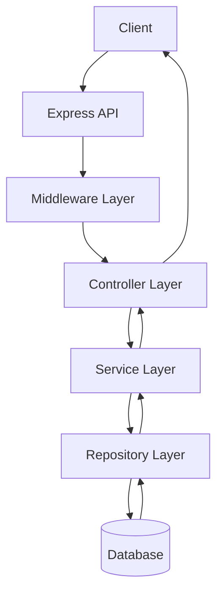
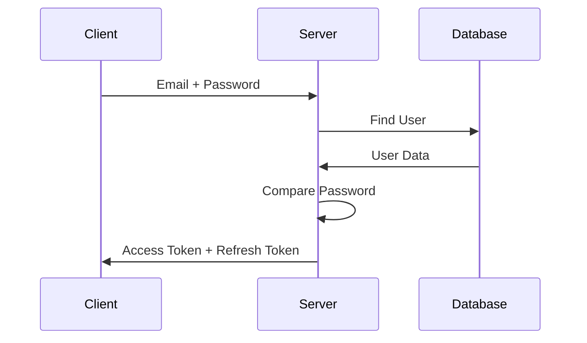

# Authentication Service - Project Requirements

## 📌 Project Overview

Authentication Service is a backend service responsible for managing user identity, authentication, and authorization.

The service allows users to:
- Register an account
- Login securely
- Access protected resources
- Manage roles and permissions
- Maintain secure sessions using tokens

---

# 🎯 Project Goal

Build a production-style authentication system following backend engineering best practices:

- Layered architecture
- Secure authentication flow
- Role-based authorization
- Input validation
- Error handling
- Database design
- API documentation
- Docker deployment

---

# 🏗️ Architecture



---

# 🛠️ Tech Stack

## Backend

- Node.js
- Express.js
- TypeScript

## Database

Primary:
- PostgreSQL

ORM:
- Prisma / Sequelize

## Security

- JWT
- bcrypt
- Refresh Tokens
- RBAC

## Tools

- Git
- Docker
- Postman
- Swagger
- Jest

---

# 📋 Functional Requirements

## 1. User Registration

### Description

Users should be able to create an account.

### Input

User provides:

- Name
- Email
- Password
- Role

Example:

```json
{
"name":"John",
"email":"john@gmail.com",
"password":"password123",
"role":"USER"
}
```

### Requirements

- Email must be unique
- Password must be hashed
- Validate user input
- Store user information securely

---

# 2. User Login

## Description

Existing users should authenticate using email and password.

### Flow



### Requirements

- Verify user credentials
- Generate JWT access token
- Generate refresh token
- Store refresh token securely

---

# 3. JWT Authentication

## Access Token

Purpose:

- Authenticate API requests

Properties:

- Short expiry time
- Contains user information

Example:

```json
{
"userId":"123",
"role":"ADMIN"
}
```

---

## Refresh Token

Purpose:

- Generate new access tokens

Requirements:

- Longer expiry
- Store in database
- Support revocation

---

# 4. Authorization (RBAC)

## Description

Control what actions users can perform based on their role.

Roles:

```
ADMIN
USER
MANAGER
```

Example:

| Role | Permission |
|---|---|
| ADMIN | Manage users |
| USER | Access own data |
| MANAGER | Manage team |

---

# 5. Password Management

Requirements:

- Hash passwords using bcrypt
- Never store plain passwords
- Support password update
- Validate password strength

---

# 6. Input Validation

Validate:

## Syntactic Validation

Example:

Email format:

```
abc@gmail.com
```

---

## Semantic Validation

Example:

Age cannot be negative.

---

## Type Validation

Example:

Password should be string.

---

# 7. Error Handling

## Requirements

Centralized error handling.

Example:

```text
Invalid credentials
```

Do not reveal sensitive information.

Avoid:

```
Email does not exist
Password is wrong
```

---

# 8. Middleware Requirements

## Authentication Middleware

Responsibilities:

- Verify JWT
- Extract user information
- Attach user to request


Flow:

```
Request

↓

JWT Middleware

↓

Verify Token

↓

Attach User

↓

Controller
```

---

## Authorization Middleware

Responsibilities:

- Check user role
- Allow or deny access

---

# 9. API Endpoints

## Authentication APIs

### Register User

```
POST /api/auth/register
```

Request:

```json
{
"name":"John",
"email":"john@gmail.com",
"password":"password123"
}
```

---

### Login User

```
POST /api/auth/login
```

---

### Refresh Token

```
POST /api/auth/refresh
```

---

### Logout

```
POST /api/auth/logout
```

---

# 10. Database Design

## Users Table

```
Users

id
name
email
password_hash
role
created_at
updated_at
```

---

## Refresh Token Table

```
RefreshTokens

id
user_id
token
expires_at
is_revoked
created_at
```

---

# 11. Security Requirements

Implement:

- Password hashing
- JWT validation
- Rate limiting
- CORS configuration
- Helmet security headers
- Environment variables
- Secure cookies
- HTTPS support

---

# 12. Logging

Track:

- Login attempts
- Authentication failures
- API errors

Avoid logging:

- Passwords
- Tokens
- Sensitive data

---

# 13. Testing Requirements

## Unit Testing

Test:

- Authentication service
- Token generation
- Password validation


## API Testing

Test:

- Register API
- Login API
- Protected routes

---

# 14. Docker Requirements

Application should run using:

```bash
docker-compose up
```

Containers:

```
Backend Container

+

PostgreSQL Container
```

---

# 15. Documentation

Create:

- README.md
- API Documentation
- Architecture Diagram
- Database Schema
- Setup Instructions

---

# Development Phases

## Phase 1: Project Setup

- Initialize Node project
- Configure TypeScript
- Setup Express
- Setup database

---

## Phase 2: User Management

- User model
- Registration API
- Password hashing

---

## Phase 3: Authentication

- Login API
- JWT generation
- Refresh tokens

---

## Phase 4: Authorization

- RBAC middleware
- Protected routes

---

## Phase 5: Production Features

- Error handling
- Logging
- Testing
- Docker
- Documentation

---

# Final Project Checklist

- [ ] User Registration
- [ ] User Login
- [ ] JWT Authentication
- [ ] Refresh Token System
- [ ] RBAC
- [ ] Validation
- [ ] Error Handling
- [ ] Logging
- [ ] Testing
- [ ] Docker
- [ ] Swagger Documentation
- [ ] README
- [ ] Deployment

---

# Interview Explanation

"I built an authentication service using Node.js and Express following layered architecture. It implements JWT-based authentication with refresh tokens, RBAC authorization, secure password hashing, validation middleware, centralized error handling, and Docker-based deployment."