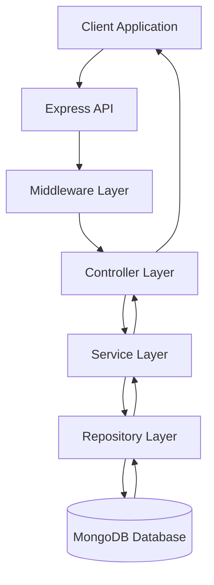

> [!info]
> **Project:** Authentication Service  
> **Phase:** Project Overview  
> **Document Type:** Architecture Overview  
> **Objective:** Explain the overall backend architecture and communication flow.

---

# 📖 Overview

The Authentication Service follows a **Layered Architecture** pattern.

The purpose of this architecture is to separate responsibilities between different parts of the application.

This improves:

- Maintainability
- Scalability
- Testability
- Code organization

---

# 🏗️ High-Level Architecture



---

# 🔄 Request Lifecycle

Every request follows this flow:

```text
Client Request

↓

Express Server

↓

Middleware

↓

Controller

↓

Service

↓

Repository

↓

Database

↓

Repository

↓

Service

↓

Controller

↓

Response
```

---

# Layer Responsibilities

## 1. API Layer

### Responsibility

Handles communication between client and backend.

### Handles:

- HTTP requests
- Routes
- Responses

Example:

```
POST /api/auth/login
```

The API layer receives the request and forwards it.

---

# 2. Middleware Layer

### Responsibility

Handles operations that happen before reaching controllers.

Examples:

- Authentication
- Authorization
- Validation
- Logging
- Error handling

Example:

```
Request

↓

JWT Verification

↓

Controller
```

---

# 3. Controller Layer

### Responsibility

Handles incoming requests and outgoing responses.

The controller:

- Receives request data.
- Calls business logic.
- Sends response.

Example:

```text
Login Request

↓

Login Controller

↓

Login Response
```

---

## Controller Should NOT:

❌ Write database queries.

❌ Contain complex business logic.

Example:

Wrong:

```javascript
Controller

↓

Check Password

↓

Generate Token

↓

Save Database
```

---

Correct:

```text
Controller

↓

Service
```

---

# 4. Service Layer

### Responsibility

Contains business logic.

This is the brain of the application.

Examples:

- Register user.
- Verify password.
- Generate JWT.
- Create refresh token.

Example:

```
Login Service

↓

Find User

↓

Compare Password

↓

Generate Tokens
```

---

# 5. Repository Layer

### Responsibility

Handles database communication.

The repository talks directly with MongoDB.

Examples:

- Find user.
- Create user.
- Update user.
- Delete user.

Example:

```
Service

↓

User Repository

↓

MongoDB
```

---

# 6. Database Layer

### Responsibility

Stores and manages application data.

Our database:

```
MongoDB
```

Stores:

- Users
- Refresh Tokens
- Roles

---

# Why Use Layered Architecture?

## 1. Separation of Concerns

Each layer has one responsibility.

Example:

Controller:

```
Handle HTTP
```

Service:

```
Handle Business Logic
```

Repository:

```
Handle Database
```

---

## 2. Easier Testing

Each layer can be tested independently.

Example:

Service can be tested without calling the real database.

---

## 3. Easier Maintenance

If database changes:

```
MongoDB

↓

PostgreSQL
```

Only repository layer needs major changes.

---

## 4. Team Collaboration

Multiple developers can work on different layers.

Example:

Developer A:

```
Controllers
```

Developer B:

```
Services
```

Developer C:

```
Database
```

---

# Authentication Request Example

## Login Flow

User sends:

```
POST /api/auth/login
```

with:

```json
{
"email":"john@gmail.com",
"password":"password123"
}
```

---

Flow:

```
Client

↓

Express Route

↓

Auth Middleware

↓

Login Controller

↓

Auth Service

↓

User Repository

↓

MongoDB

↓

Verify User

↓

Generate JWT

↓

Return Response
```

---

# Folder Structure Mapping

Our architecture will map to:

```
src/

├── controllers/

├── services/

├── repositories/

├── middleware/

├── models/

├── routes/

├── utils/

└── server.ts
```

---

# Dependency Direction

The dependency should always flow downward.

Correct:

```
Controller

↓

Service

↓

Repository

↓

Database
```

Wrong:

```
Repository

↓

Controller
```

Lower layers should not depend on higher layers.

---

# Real-Life Example

Restaurant Example:

| Backend Layer | Restaurant Role |
|-|-|
| Controller | Waiter |
| Service | Chef |
| Repository | Storage Manager |
| Database | Food Storage |
| Client | Customer |

Customer talks only to waiter.

Customer does not directly access the kitchen.

---

# 📝 Summary

The Authentication Service follows a layered architecture where each layer has a specific responsibility.

The request flows from client → API → Middleware → Controller → Service → Repository → Database and returns back through the same layers.

This design keeps the application clean, maintainable, scalable, and easier to test.

---

# 🧠 Key Takeaways

- Architecture defines how system components communicate.
- Layered architecture separates responsibilities.
- Controllers handle requests.
- Services contain business logic.
- Repositories handle database operations.
- Database stores application data.
- Good architecture improves scalability and maintainability.

---

# 🔗 Related Notes

- [[06 - Tech Stack]]
- [[08 - Development Phases]]
- [[01 - Layered Architecture]]
- [[02 - Request Lifecycle]]