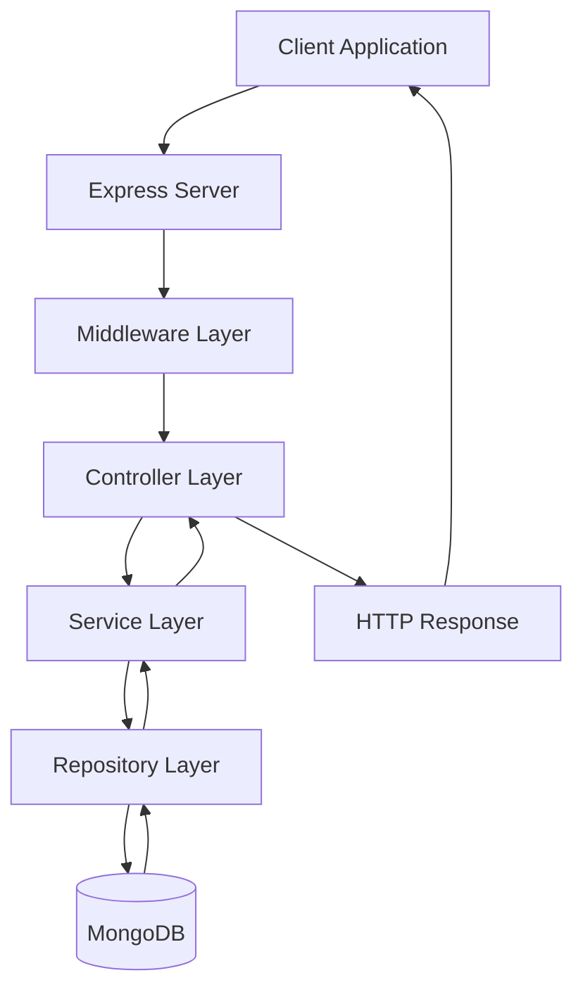

> [!info]
> **Project:** Authentication Service  
> **Section:** Architecture  
> **Document Type:** Request Flow Documentation  
> **Objective:** Explain how a request travels through the backend system from client to response.

---

# 📖 Overview

Request lifecycle describes the complete journey of an HTTP request inside the Authentication Service.

It explains:

- How requests enter the system.
- How different backend layers process them.
- How responses are generated.

Understanding request lifecycle helps developers debug issues and design better APIs.

---

# 🔄 High-Level Request Flow



---

# Step-by-Step Request Lifecycle

---

# 1. Client Sends Request

The process starts when a client sends an HTTP request.

Example:

```
POST /api/auth/login
```

Request body:

```json
{
"email":"john@gmail.com",
"password":"password123"
}
```

The request contains:

- HTTP method.
- URL.
- Headers.
- Body data.

---

# 2. Express Server Receives Request

The request reaches our Node.js + Express server.

Example:

```
Client

↓

Express Server
```

The server checks:

- Which route matches this request?
- Which middleware should execute?

---

Example:

```javascript
app.use("/api/auth", authRoutes)
```

---

# 3. Middleware Processing

Before reaching controllers, the request passes through middleware.

Middleware works like a security checkpoint.

---

Examples:

## Logger Middleware

Tracks:

```
Request method

Request URL

Timestamp
```

---

## Authentication Middleware

Checks:

```
Is JWT valid?
```

---

## Validation Middleware

Checks:

```
Is request data correct?
```

---

Flow:

```
Request

↓

Middleware

↓

Controller
```

---

# 4. Controller Layer

The controller receives the processed request.

Its responsibilities:

- Extract request data.
- Call service methods.
- Return response.

---

Example:

```text
Login Request

↓

AuthController

↓

AuthService
```

---

Controller does NOT:

❌ Query database

❌ Hash password

❌ Generate complex business logic

---

# 5. Service Layer

The service layer executes business logic.

Example: Login Service

Steps:

```
Receive email/password

↓

Find user

↓

Compare password

↓

Generate JWT

↓

Create refresh token

```

---

The service decides:

- What should happen?
- What rules should apply?

---

# 6. Repository Layer

The service communicates with the repository.

Repository handles database operations.

Example:

```
AuthService

↓

UserRepository

↓

MongoDB
```

---

Repository operations:

```
findUserByEmail()

createUser()

saveRefreshToken()
```

---

# 7. Database Layer

MongoDB processes the database request.

Example:

Find user:

```javascript
{
email:"john@gmail.com"
}
```

Database returns:

```json
{
"id":"123",
"name":"John",
"password_hash":"hashedPassword",
"role":"USER"
}
```

---

# 8. Response Travels Back

After processing:

```
Database

↓

Repository

↓

Service

↓

Controller

↓

Client
```

---

Example Response:

```json
{
"message":"Login successful",
"accessToken":"jwt_token"
}
```

---

# Complete Login Request Example

## User Action

User enters:

```
Email
Password
```

---

## Request

```
POST /api/auth/login
```

---

## Flow

```
Client

↓

Express Router

↓

Validation Middleware

↓

Auth Controller

↓

Auth Service

↓

User Repository

↓

MongoDB

↓

Verify Password

↓

Generate JWT

↓

Controller Response

↓

Client
```

---

# Middleware Order

Middleware order matters.

Example:

Correct:

```
Request

↓

CORS

↓

Logger

↓

Authentication

↓

Authorization

↓

Validation

↓

Controller
```

---

Why?

Because some operations depend on previous operations.

Example:

Authorization requires authentication.

Wrong:

```
Authorization

↓

Authentication
```

The system does not know who the user is.

---

# Error Flow

Errors can happen at any layer.

Example:

Database failure:

```
Repository

↓

Service

↓

Controller

↓

Error Middleware

↓

Client
```

---

Example Response:

```json
{
"message":"Internal server error"
}
```

---

# Authentication Service Request Example

## Register User

Request:

```
POST /api/auth/register
```

Flow:

```
Client

↓

Express Route

↓

Validation Middleware

↓

Register Controller

↓

Register Service

↓

User Repository

↓

MongoDB

↓

Hash Password

↓

Save User

↓

Response
```

---

## Access Protected Route

Request:

```
GET /api/profile
```

Flow:

```
Client

↓

JWT Middleware

↓

Verify Token

↓

Attach User

↓

Controller

↓

Service

↓

Response
```

---

# Why Understanding Request Lifecycle Matters?

## 1. Debugging

When something fails, we know where to look.

Example:

Login failure:

```
Controller?

Service?

Repository?

Database?
```

---

## 2. Better Design

Developers know where new logic belongs.

Example:

Password hashing:

Correct:

```
Service Layer
```

Wrong:

```
Controller Layer
```

---

## 3. Security

Security checks happen at the correct stage.

Example:

JWT verification before accessing protected resources.

---

# Real-Life Example

Airport Security:

```
Passenger

↓

Ticket Counter

↓

Security Check

↓

Boarding Gate

↓

Flight
```

Backend:

```
Request

↓

Route

↓

Middleware

↓

Controller

↓

Service

↓

Database
```

Each checkpoint has a purpose.

---

# 📝 Summary

Request lifecycle explains how an HTTP request travels through the Authentication Service.

The request moves through:

```
Client

↓

Express

↓

Middleware

↓

Controller

↓

Service

↓

Repository

↓

Database
```

The response returns through the same layers.

Understanding this flow is essential for designing, debugging, and maintaining backend systems.

---

# 🧠 Key Takeaways

- Every request follows a defined path.
- Middleware runs before controllers.
- Controllers handle communication.
- Services handle business logic.
- Repositories handle data access.
- Database stores information.
- Understanding request flow helps debugging and architecture decisions.

---

# 🔗 Related Notes

- [[01 - Layered Architecture]]
- [[03 - MVC vs Layered]]
- [[04 - Dependency Flow]]
- [[05 - Error Flow]]