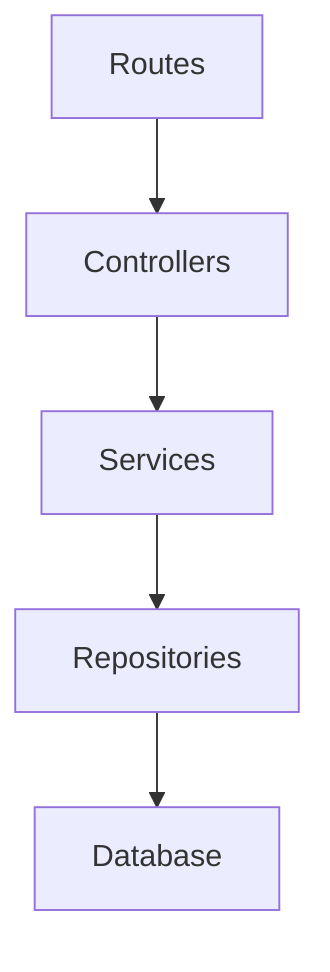

> [!info]
> **Project:** Authentication Service  
> **Section:** Architecture  
> **Document Type:** Dependency Design  
> **Objective:** Define how different layers communicate and maintain clean architecture.

---

# 📖 Overview

Dependency flow defines the direction in which different parts of the application communicate.

In a well-designed backend system, higher-level layers depend on lower-level layers.

The dependency direction should always be predictable.

---

# 🏗️ Dependency Direction

Our Authentication Service follows:

```text
Routes

↓

Controllers

↓

Services

↓

Repositories

↓

Database
```

---

# Basic Rule

## Higher Layer → Lower Layer

Allowed:

```text
Controller

↓

Service
```

```text
Service

↓

Repository
```

```text
Repository

↓

Database
```

---

Not allowed:

```text
Database

↓

Controller
```

```text
Repository

↓

Service
```

---

# Layer Dependency Explanation

---

# 1. Routes Dependency

## Routes depend on:

```
Controllers
```

Purpose:

Routes decide:

- Which endpoint exists.
- Which controller handles the request.

Example:

```text
POST /login

↓

loginController()
```

---

Structure:

```
routes

↓

controllers
```

---

# 2. Controller Dependency

## Controllers depend on:

```
Services
```

Purpose:

Controllers receive HTTP requests and delegate work.

Example:

```text
LoginController

↓

AuthService.login()
```

---

Controller should NOT depend on:

❌ Database

❌ Repository directly

---

Why?

Because controller should only handle HTTP communication.

---

# 3. Service Dependency

## Services depend on:

```
Repositories
```

Purpose:

Services execute business logic and use repositories for data access.

Example:

```
AuthService

↓

UserRepository

↓

Database
```

---

Service handles:

- Authentication rules.
- Token generation.
- Password verification.

---

# 4. Repository Dependency

## Repositories depend on:

```
Database
```

Purpose:

Repository communicates with data storage.

Example:

```
UserRepository

↓

MongoDB
```

---

Repository handles:

- Queries.
- Data creation.
- Data updates.

---

# Complete Dependency Diagram



---

# Dependency Rules

## Rule 1: Controllers Should Not Access Database Directly

Wrong:

```javascript
Controller

↓

MongoDB
```

Example:

```javascript
loginController(){

User.findOne()

}
```

---

Correct:

```javascript
Controller

↓

Service

↓

Repository

↓

Database
```

---

# Rule 2: Services Should Not Handle HTTP

Wrong:

```javascript
AuthService(){

res.status(200)

}
```

---

Why?

Services should work independently.

They should not know:

- Express.
- Request.
- Response.

---

Correct:

```
Controller

↓

Service
```

---

# Rule 3: Repository Should Not Contain Business Logic

Wrong:

```
UserRepository

↓

Generate JWT

↓

Hash Password
```

---

Correct:

```
Service

↓

Business Logic

↓

Repository

↓

Database
```

---

# Rule 4: Database Should Be Hidden

Application code should not directly interact with the database everywhere.

Wrong:

```
Controller

↓

MongoDB

↓

Service

↓

MongoDB
```

---

Correct:

```
Service

↓

Repository

↓

Database
```

---

# Example: User Registration Flow

## Request

```
POST /api/auth/register
```

---

## Dependency Flow

```
Route

↓

Register Controller

↓

Auth Service

↓

User Repository

↓

MongoDB
```

---

## Responsibilities

### Controller

Receives:

```json
{
"name":"John",
"email":"john@gmail.com",
"password":"123456"
}
```

---

### Service

Handles:

```
Validate user

Hash password

Apply business rules
```

---

### Repository

Handles:

```
Save user data
```

---

# Why Dependency Flow Matters?

---

# 1. Maintainability

Changing one part does not break everything.

Example:

Changing database:

```
MongoDB

↓

PostgreSQL
```

Only repository changes.

---

# 2. Testing

Each layer can be tested independently.

Example:

Testing service:

```
AuthService

↓

Mock Repository
```

No real database needed.

---

# 3. Scalability

New features can be added cleanly.

Example:

Adding Google Login:

```
OAuth Service

↓

User Repository
```

---

# 4. Team Development

Developers can work independently.

Example:

Developer A:

```
Controllers
```

Developer B:

```
Services
```

Developer C:

```
Repositories
```

---

# Real-Life Example

Office Structure:

```
Customer

↓

Receptionist

↓

Manager

↓

Employee

↓

Resources
```

Customer does not directly contact resources.

Each level has a responsibility.

---

# Project Folder Mapping

```
src/

routes/

↓

controllers/

↓

services/

↓

repositories/

↓

models/

↓

database/
```

---

# 📝 Summary

Dependency flow defines how different layers communicate in the Authentication Service.

The correct flow is:

```
Routes

↓

Controllers

↓

Services

↓

Repositories

↓

Database
```

Each layer depends only on the layer below it.

This creates clean, maintainable, and scalable backend architecture.

---

# 🧠 Key Takeaways

- Dependencies should flow in one direction.
- Controllers handle HTTP only.
- Services handle business logic.
- Repositories handle database access.
- Avoid direct database access from controllers.
- Clean dependency flow improves testing and scalability.

---

# 🔗 Related Notes

- [[01 - Layered Architecture]]
- [[02 - Request Lifecycle]]
- [[03 - MVC vs Layered]]
- [[05 - Error Flow]]