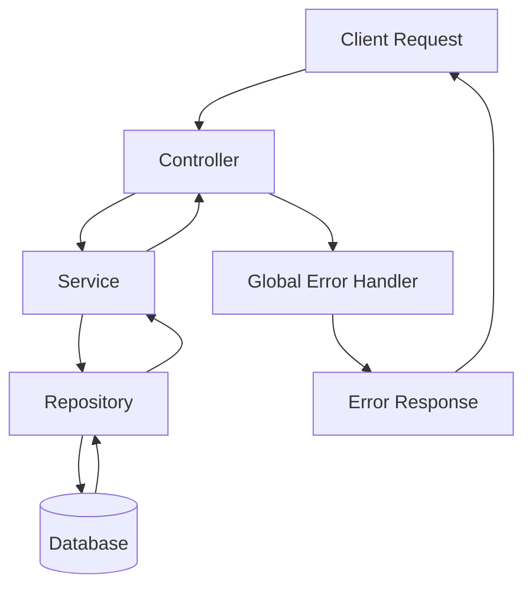

> [!info]
> **Project:** Authentication Service  
> **Section:** Architecture  
> **Document Type:** Error Handling Design  
> **Objective:** Explain how errors are handled and propagated throughout the backend system.

---

# 📖 Overview

Error handling is a critical part of backend development.

A production application must handle errors properly to:

- Prevent application crashes.
- Provide meaningful responses.
- Protect sensitive information.
- Improve debugging.

---

# Why Error Handling Is Important?

Without proper error handling:

Example:

```
Database Error

↓

Application crashes

↓

User sees nothing
```

Problems:

- Poor user experience.
- Difficult debugging.
- Security risks.

---

With proper error handling:

```
Error Occurs

↓

Capture Error

↓

Log Error

↓

Send Safe Response
```

---

# Error Flow Architecture



---

# Error Handling Layers

Our Authentication Service handles errors at different levels.

---

# 1. Validation Errors

## Where?

Before business logic execution.

Handled by:

```
Validation Middleware
```

---

Example:

User sends:

```json
{
"email":"invalid-email",
"password":"123"
}
```

---

Error:

```json
{
"message":"Invalid input data"
}
```

---

Examples:

- Invalid email format.
- Weak password.
- Missing required fields.

---

# 2. Authentication Errors

## Where?

During authentication process.

Handled by:

```
Authentication Service
```

---

Example:

Wrong password:

```
User Login

↓

Compare Password

↓

Password mismatch

↓

Authentication Error
```

---

Response:

```json
{
"message":"Invalid credentials"
}
```

---

# 3. Authorization Errors

## Where?

During permission checking.

Handled by:

```
Authorization Middleware
```

---

Example:

User tries to access admin API.

```
USER

↓

Admin Route

↓

Access Denied
```

---

Response:

```json
{
"message":"Forbidden"
}
```

---

# 4. Database Errors

## Where?

Repository layer.

Examples:

- Database unavailable.
- Query failure.
- Connection error.

---

Flow:

```
Repository

↓

Database Error

↓

Service

↓

Controller

↓

Error Handler
```

---

Response:

```json
{
"message":"Internal server error"
}
```

---

# 5. System Errors

Examples:

- Server crash.
- Memory issue.
- Configuration failure.

Handled by:

```
Global Error Handler
```

---

# Error Propagation Flow

Errors should move upward.

Example:

```
Database

↓

Repository

↓

Service

↓

Controller

↓

Global Error Handler

↓

Client
```

---

# Global Error Handling

Express provides centralized error handling middleware.

Example:

```javascript
app.use(errorHandler)
```

---

Purpose:

- Catch all application errors.
- Format responses.
- Log errors.

---

# Why Centralized Error Handling?

Without it:

Every controller handles errors differently.

Example:

Controller 1:

```json
{
"error":"Failed"
}
```

Controller 2:

```json
{
"message":"Something wrong"
}
```

Problem:

Inconsistent responses.

---

With centralized handling:

All errors follow one format.

Example:

```json
{
"success":false,
"message":"Invalid credentials"
}
```

---

# Custom Error Classes

Instead of throwing normal errors:

Example:

```javascript
throw new Error()
```

We create meaningful errors.

Example:

```
AuthenticationError

ValidationError

NotFoundError
```

---

Example:

```text
UserNotFoundError

↓

404 Response
```

---

# HTTP Error Status Codes

## 400 Bad Request

Meaning:

Client sent invalid data.

Example:

```
Invalid email format
```

---

## 401 Unauthorized

Meaning:

Authentication failed.

Example:

```
Invalid JWT token
```

---

## 403 Forbidden

Meaning:

User is authenticated but not allowed.

Example:

```
USER accessing ADMIN API
```

---

## 404 Not Found

Meaning:

Resource does not exist.

Example:

```
User not found
```

---

## 500 Internal Server Error

Meaning:

Unexpected server failure.

Example:

```
Database crashed
```

---

# Security Considerations

Never expose internal errors.

---

Wrong:

```json
{
"message":
"MongoDB connection failed at port 27017"
}
```

Why?

It reveals system information.

---

Correct:

```json
{
"message":
"Internal server error"
}
```

---

# Logging Errors

Errors should be logged for developers.

Log:

✅ Error message

✅ Timestamp

✅ Request information

✅ Stack trace

---

Do NOT log:

❌ Passwords

❌ JWT tokens

❌ Sensitive user data

---

# Example Authentication Error Flow

Scenario:

User enters wrong password.

```
Client

↓

Login Controller

↓

Auth Service

↓

Password Comparison

↓

Password Failed

↓

Authentication Error

↓

Global Error Handler

↓

401 Response

↓

Client
```

---

# Project Error Handling Structure

Future structure:

```
src/

├── errors/

│   ├── AppError.ts
│   ├── AuthError.ts
│   └── ValidationError.ts


├── middleware/

│   └── errorHandler.ts
```

---

# Real-Life Example

Hospital Emergency System:

```
Patient

↓

Reception

↓

Doctor

↓

Specialist

↓

Treatment
```

If a problem occurs:

```
Problem detected

↓

Reported to responsible person

↓

Handled properly

↓

Patient receives response
```

Backend errors work the same way.

---

# 📝 Summary

Error flow defines how errors move through the Authentication Service.

Errors are captured, processed, logged, and returned as safe responses.

The flow is:

```
Error

↓

Service/Repository/Controller

↓

Global Error Handler

↓

Client Response
```

Centralized error handling improves reliability, security, and maintainability.

---

# 🧠 Key Takeaways

- Errors are part of backend design.
- Do not expose sensitive information.
- Use centralized error handling.
- Services throw business errors.
- Controllers forward errors.
- Global middleware formats responses.
- Proper logging helps debugging.

---

# 🔗 Related Notes

- [[01 - Layered Architecture]]
- [[02 - Request Lifecycle]]
- [[03 - MVC vs Layered]]
- [[04 - Dependency Flow]]
- [[06 - Tech Stack]]