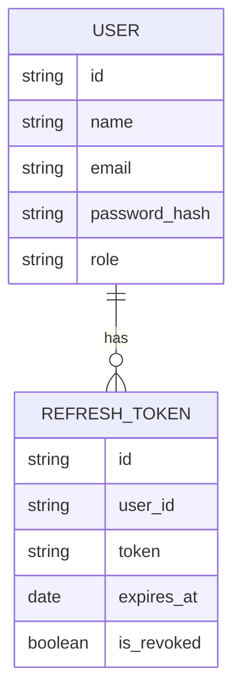

> [!info]
> **Project:** Authentication Service  
> **Section:** Database Design  
> **Document Type:** Database Relationship Design  
> **Objective:** Understand entity relationships and how User and Refresh Token are connected.

---

# 📖 Overview

Database relationships define how different entities are connected.

In the Authentication Service, we need relationships between:

```
User

↓

Refresh Token
```

A user can have multiple active sessions.

Example:

```
User

↓

Laptop Session

↓

Mobile Session

↓

Tablet Session
```

---

# Entities in Authentication Service

Currently:

```
Users

RefreshTokens
```

---

# User Entity

Stores user information:

```
User

id

name

email

password_hash

role

created_at

updated_at
```

---

# Refresh Token Entity

Stores authentication sessions:

```
RefreshToken

id

user_id

token

expires_at

is_revoked

created_at
```

---

# Relationship Type

Our relationship:

```
One User

        |

        |

Many Refresh Tokens
```

This is called:

# One-to-Many Relationship

---

# What is One-to-Many?

One entity can have multiple related entities.

Example:

```
One User

↓

Multiple Refresh Tokens
```

---

Real-life example:

A person can have:

```
One Account

↓

Multiple Devices
```

Example:

```
Goushik Account

├── Laptop Login

├── Mobile Login

└── Tablet Login
```

---

# Database Relationship Diagram



---

# Relationship Explanation

User:

```
id: user123
```

Refresh Tokens:

```
token1

user_id: user123


token2

user_id: user123
```

Both tokens belong to:

```
user123
```

---

# Why Do We Need This Relationship?

Because we need to know:

## 1. Who owns a token?

Example:

Refresh request:

```
Refresh Token

↓

Find Owner

↓

Find User

↓

Generate Access Token
```

---

## 2. Logout Management

User logs out:

```
User

↓

Find Active Tokens

↓

Revoke Token
```

---

## 3. Multiple Device Support

Example:

User logged in from:

```
Chrome Browser

Mobile App

Tablet
```

Each creates:

```
Separate Refresh Token
```

---

# MongoDB Relationship Approach

MongoDB supports relationships in two ways:

1. Embedding
2. Referencing

---

# 1. Embedding

Data is stored inside another document.

Example:

```json
{
"name":"John",

"refreshTokens":[

{
"token":"abc"
},

{
"token":"xyz"
}

]
}
```

---

Problem:

For authentication:

- Tokens can grow.
- Difficult to revoke individually.
- Large user documents.

---

# 2. Referencing

Store separate documents and connect using ID.

Example:

User:

```json
{
"_id":"user123",
"name":"John"
}
```

---

Refresh Token:

```json
{
"user_id":"user123",
"token":"abc"
}
```

---

We choose:

# Referencing

---

# Why Referencing?

## 1. Better Scalability

A user can have many sessions.

Example:

```
100 devices

=

100 refresh tokens
```

---

## 2. Easy Token Management

We can:

- Delete token.
- Revoke token.
- Check expiry.

---

## 3. Cleaner Design

User data and session data remain separate.

---

# Application Relationship Flow

Example:

User Login:

```
Login Request

↓

Find User

↓

Validate Password

↓

Create Refresh Token

↓

Store Refresh Token

↓

Link using user_id
```

---

# Logout Relationship Flow

```
Logout Request

↓

Receive Refresh Token

↓

Find Token

↓

Check user_id

↓

Revoke Token

↓

Session Closed
```

---

# Database Access Flow

Our architecture:

```
Controller

↓

Service

↓

Repository

↓

Database
```

---

Example:

Get User Sessions:

```
Session Controller

↓

Session Service

↓

RefreshToken Repository

↓

MongoDB
```

---

# Relationship Rules

## Rule 1

A Refresh Token must belong to a User.

Invalid:

```
RefreshToken

without

user_id
```

---

## Rule 2

A User can exist without active tokens.

Example:

New user:

```
Registered

↓

No login yet
```

---

## Rule 3

Deleting User should handle tokens.

Example:

Delete account:

```
Delete User

↓

Delete Associated Tokens
```

---

# Future Relationship Possibilities

As the project grows:

```
User

↓

Roles

↓

Permissions
```

---

Example:

```
ADMIN

↓

Can Manage Users
```

---

Future entities:

```
User

Role

Permission

Audit Log

Login History
```

---

# 📝 Summary

The Authentication Service uses a One-to-Many relationship:

```
User

↓

Many Refresh Tokens
```

MongoDB references refresh tokens using:

```
user_id
```

This design supports:

- Multiple devices.
- Session management.
- Token revocation.
- Better scalability.

---

# 🧠 Key Takeaways

- Relationships connect database entities.
- User and Refresh Token have One-to-Many relationship.
- Referencing is better for session data.
- user_id connects refresh tokens to users.
- Good database design improves scalability.

---

# 🔗 Related Notes

- [[01 - Database Overview]]
- [[02 - User Entity Design]]
- [[03 - Refresh Token Design]]
- [[05 - Database Security]]
- [[01 - Layered Architecture]]