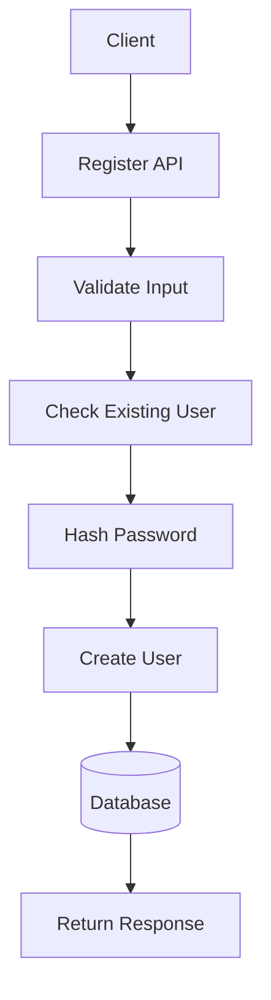

> [!info]
> **Project:** Authentication Service  
> **Section:** API Design  
> **API:** User Registration  
> **Objective:** Design the API contract for creating a new user account.

---

# 📖 Overview

The Register API allows a new user to create an account in the Authentication Service.

The API is responsible for:

- Receiving user information.
- Validating input.
- Checking existing users.
- Hashing passwords.
- Creating user records.
- Returning registration status.

---

# API Endpoint

## Register User

```
POST /api/v1/auth/register
```

---

# Purpose

Creates a new user account.

Example:

```
New User

↓

Register API

↓

User Stored in Database
```

---

# Request Flow



---

# Request Headers

```http
Content-Type: application/json
```

---

# Request Body

The client sends:

```json
{
"name":"John Doe",
"email":"john@gmail.com",
"password":"Password@123",
"role":"USER"
}
```

---

# Request Fields

| Field | Type | Required | Description |
|-|-|-|-|
| name | String | Yes | User full name |
| email | String | Yes | Unique email address |
| password | String | Yes | User password |
| role | String | Yes | User access role |

---

# Validation Rules

Before creating a user, validate:

---

# Name Validation

Rules:

- Required.
- Minimum length.
- Maximum length.

Example:

Valid:

```
John Doe
```

Invalid:

```
(empty)
```

---

# Email Validation

Rules:

- Required.
- Valid email format.
- Must be unique.

Valid:

```
john@gmail.com
```

Invalid:

```
john123
```

---

# Password Validation

Rules:

- Minimum 8 characters.
- Contains uppercase letter.
- Contains lowercase letter.
- Contains number.
- Contains special character.

Example:

Valid:

```
Password@123
```

Invalid:

```
12345
```

---

# Role Validation

Allowed roles:

```
USER

ADMIN

MANAGER
```

Invalid:

```
UNKNOWN_ROLE
```

---

# Database Interaction

After validation:

## Step 1: Check Existing User

Query:

```
Find user by email
```

Example:

Database:

```
users collection

email:
john@gmail.com
```

If exists:

```
Registration rejected
```

---

## Step 2: Hash Password

User password:

```
Password@123
```

↓

bcrypt:

```
$2b$10$8dh73....
```

Database stores:

```
password_hash
```

Never store:

```
Password@123
```

---

## Step 3: Create User

Database record:

```json
{
"id":"123",
"name":"John Doe",
"email":"john@gmail.com",
"password_hash":"hashed_password",
"role":"USER"
}
```

---

# Success Response

## HTTP Status

```
201 Created
```

---

Response:

```json
{
"success":true,
"message":"User registered successfully",
"data":{
 "id":"123",
 "name":"John Doe",
 "email":"john@gmail.com",
 "role":"USER"
}
}
```

---

# Important

Do not return:

```json
{
"password_hash":"..."
}
```

Sensitive data should never leave the server.

---

# Error Responses

---

# 1. Email Already Exists

Status:

```
409 Conflict
```

Response:

```json
{
"success":false,
"message":"Email already registered"
}
```

---

# 2. Invalid Input

Status:

```
400 Bad Request
```

Response:

```json
{
"success":false,
"message":"Validation failed",
"errors":[
"Invalid email",
"Password too weak"
]
}
```

---

# 3. Server Error

Status:

```
500 Internal Server Error
```

Response:

```json
{
"success":false,
"message":"Internal server error"
}
```

---

# Register API Architecture Flow

```text
Client

↓

Route

↓

Validation Middleware

↓

Register Controller

↓

Auth Service

↓

User Repository

↓

Database

↓

Response
```

---

# Layer Responsibilities

## Route Layer

Responsible for:

- API URL.
- HTTP method.

Example:

```
POST /register
```

---

## Middleware Layer

Responsible for:

- Input validation.
- Request checks.

---

## Controller Layer

Responsible for:

- Receiving request.
- Sending response.

Does not contain business logic.

---

## Service Layer

Responsible for:

- User registration logic.
- Password hashing.
- Business rules.

---

## Repository Layer

Responsible for:

- Database operations.

Example:

```
Create User

Find User
```

---

# Security Considerations

## Password

- Hash using bcrypt.
- Never log passwords.

---

## Email

- Prevent duplicate accounts.
- Normalize email.

Example:

Convert:

```
JOHN@GMAIL.COM
```

to:

```
john@gmail.com
```

---

## Error Messages

Avoid:

```
Email exists
```

in some systems because it reveals user information.

---

# Future Implementation Files

During coding, this API will be implemented in:

```
src/

routes/

auth.routes.ts


controllers/

auth.controller.ts


services/

auth.service.ts


repositories/

user.repository.ts


models/

user.model.ts
```

---

# Testing Scenarios

## Success Case

Input:

```json
{
"name":"John",
"email":"john@gmail.com",
"password":"Password@123",
"role":"USER"
}
```

Expected:

```
201 Created
```

---

## Duplicate Email

Input:

```
Existing email
```

Expected:

```
409 Conflict
```

---

## Invalid Password

Input:

```
12345
```

Expected:

```
400 Bad Request
```

---

# 📝 Summary

The Register API creates a new user account securely.

Flow:

```
Receive User Data

↓

Validate Input

↓

Check Existing User

↓

Hash Password

↓

Save User

↓

Return Success Response
```

---

# 🧠 Key Takeaways

- Registration is the first authentication step.
- Validate before storing data.
- Never store plain passwords.
- Separate controller and business logic.
- Return only required user information.
- Design API contract before implementation.

---

# 🔗 Related Notes

- [[01 - API Overview]]
- [[03 - Login API]]
- [[02 - Password Hashing]]
- [[02 - User Entity Design]]
- [[Validation Middleware]]