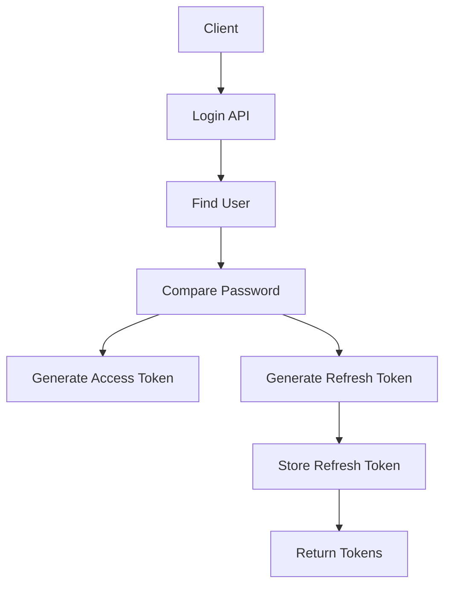

> [!info]
> **Project:** Authentication Service  
> **Section:** API Design  
> **API:** User Login  
> **Objective:** Design the API contract for user authentication and token generation.

---

# 📖 Overview

The Login API allows existing users to authenticate themselves using:

- Email
- Password

After successful authentication, the server generates:

```
Access Token

+

Refresh Token
```

These tokens allow users to access protected resources securely.

---

# API Endpoint

## Login User

```
POST /api/v1/auth/login
```

---

# Purpose

Authenticate an existing user.

Flow:

```
User

↓

Email + Password

↓

Verify Identity

↓

Generate Tokens

↓

Access Protected APIs
```

---

# Login Flow



---

# Request Headers

```http
Content-Type: application/json
```

---

# Request Body

Client sends:

```json
{
"email":"john@gmail.com",
"password":"Password@123"
}
```

---

# Request Fields

| Field | Type | Required | Description |
|-|-|-|-|
| email | String | Yes | Registered email |
| password | String | Yes | User password |

---

# Authentication Process

Login happens in multiple steps.

---

# Step 1: Validate Input

Check:

- Email exists in request.
- Password exists.
- Email format is correct.

Example:

Invalid:

```json
{
"email":"",
"password":""
}
```

Response:

```
400 Bad Request
```

---

# Step 2: Find User

Search database using email.

Query:

```
Find user where email = john@gmail.com
```

Database:

```json
{
"id":"123",
"email":"john@gmail.com",
"password_hash":"$2b$10..."
}
```

---

# Step 3: Verify Password

User enters:

```
Password@123
```

Database contains:

```
$2b$10$8hd73...
```

Using bcrypt:

```
bcrypt.compare()

↓

true / false
```

---

If password matches:

```
Authentication Successful
```

If not:

```
Authentication Failed
```

---

# Step 4: Generate Access Token

After successful login:

Generate JWT access token.

Example payload:

```json
{
"userId":"123",
"email":"john@gmail.com",
"role":"USER"
}
```

---

Access Token Purpose:

Used for:

```
API Authorization
```

Example:

```
GET /api/v1/users/profile
```

Header:

```http
Authorization: Bearer access_token
```

---

# Step 5: Generate Refresh Token

Generate refresh token.

Purpose:

Create new access tokens after expiry.

Example:

```
Access Token

Expiry:
15 minutes


Refresh Token

Expiry:
7 days
```

---

# Step 6: Store Refresh Token

Store token information:

Database:

```
RefreshTokens
```

Example:

```json
{
"user_id":"123",
"token":"refresh_token",
"expires_at":"2026-07-31",
"is_revoked":false
}
```

---

# Success Response

## HTTP Status

```
200 OK
```

---

Response:

```json
{
"success":true,
"message":"Login successful",
"data":{
"accessToken":"jwt_access_token",
"refreshToken":"jwt_refresh_token"
}
}
```

---

# Production Note

Refresh tokens are usually not returned directly.

Better approach:

```
Access Token

↓

Response Body


Refresh Token

↓

HTTP Only Secure Cookie
```

---

# Error Responses

---

# 1. User Not Found

Status:

```
401 Unauthorized
```

Response:

```json
{
"success":false,
"message":"Invalid credentials"
}
```

---

# 2. Wrong Password

Status:

```
401 Unauthorized
```

Response:

```json
{
"success":false,
"message":"Invalid credentials"
}
```

---

# Why Same Error Message?

Avoid:

```
Email does not exist
```

or:

```
Password incorrect
```

Because attackers can discover registered emails.

---

# 3. Invalid Input

Status:

```
400 Bad Request
```

Example:

```json
{
"success":false,
"message":"Validation failed"
}
```

---

# 4. Server Error

Status:

```
500 Internal Server Error
```

---

# Login API Architecture Flow

```text
Client

↓

Auth Route

↓

Validation Middleware

↓

Login Controller

↓

Auth Service

↓

User Repository

↓

Database

↓

Token Service

↓

Response
```

---

# Layer Responsibilities

## Controller

Handles:

- Request.
- Response.
- Status codes.

Example:

```
req.body.email
```

---

## Service

Handles business logic:

- Find user.
- Compare password.
- Generate tokens.

---

## Repository

Handles:

- Database queries.

Example:

```
findUserByEmail()
```

---

## Token Service

Handles:

- JWT creation.
- Token expiry.
- Token verification.

---

# Security Considerations

## Password

Never:

```
console.log(password)
```

---

## Tokens

Protect:

- Access tokens.
- Refresh tokens.

---

## Brute Force Protection

Future implementation:

```
Rate Limiting

+

Login Attempt Tracking
```

---

# Testing Scenarios

---

## Successful Login

Input:

```json
{
"email":"john@gmail.com",
"password":"Password@123"
}
```

Expected:

```
200 OK

Tokens Generated
```

---

## Wrong Password

Input:

```json
{
"email":"john@gmail.com",
"password":"wrongpassword"
}
```

Expected:

```
401 Unauthorized
```

---

## User Does Not Exist

Input:

```json
{
"email":"unknown@gmail.com",
"password":"Password@123"
}
```

Expected:

```
401 Unauthorized
```

---

# Future Implementation Files

During coding:

```
src/

controllers/

auth.controller.ts


services/

auth.service.ts


utils/

jwt.ts


repositories/

user.repository.ts
```

---

# 📝 Summary

The Login API authenticates existing users.

Complete flow:

```
Receive Credentials

↓

Find User

↓

Compare Password

↓

Generate Access Token

↓

Generate Refresh Token

↓

Create Session

↓

Return Response
```

---

# 🧠 Key Takeaways

- Login verifies user identity.
- bcrypt compares passwords securely.
- JWT provides authentication.
- Refresh tokens maintain sessions.
- Never reveal sensitive login errors.
- Authentication logic belongs in service layer.

---

# 🔗 Related Notes

- [[01 - API Overview]]
- [[02 - Register API]]
- [[04 - Refresh Token API]]
- [[03 - JWT Design]]
- [[02 - Password Hashing]]
- [[05 - Refresh Token Design]]