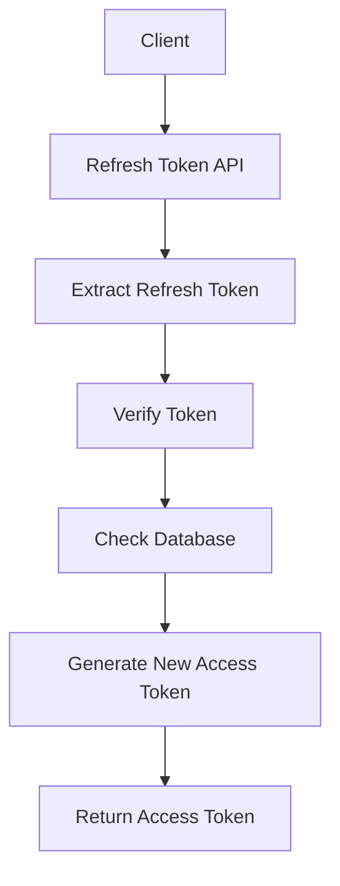

> [!info]
> **Project:** Authentication Service  
> **Section:** API Design  
> **API:** Refresh Token  
> **Objective:** Design the API responsible for generating new access tokens using refresh tokens.

---

# 📖 Overview

The Refresh Token API allows users to obtain a new access token without logging in again.

Access tokens are intentionally short-lived for security.

Example:

```
Access Token

Expiry:
15 minutes
```

When it expires:

```
Refresh Token

↓

Generate New Access Token
```

---

# API Endpoint

## Refresh Access Token

```
POST /api/v1/auth/refresh
```

---

# Purpose

Generate a new access token using a valid refresh token.

---

# Why Do We Need This API?

Problem:

```
User Login

↓

Access Token Created

↓

15 minutes later

↓

Access Token Expired
```

Without refresh tokens:

```
User must login again
```

Bad user experience.

---

Solution:

```
Refresh Token

↓

New Access Token

↓

Continue Session
```

---

# Refresh Token Flow



---

# Request

The client sends:

```
Refresh Token
```

Usually through:

```
HTTP Only Secure Cookie
```

---

# Request Header

Example:

```http
Cookie:
refreshToken=xxxxxxxx
```

---

# Request Body

Option 1:

```json
{
"refreshToken":"token_value"
}
```

---

Production approach:

```
HTTP Only Cookie
```

because JavaScript cannot access it.

---

# Refresh Token Validation Process

The server performs multiple checks.

---

# Step 1: Extract Refresh Token

Server receives:

```
refreshToken
```

---

# Step 2: Verify JWT Signature

Check:

- Token is valid.
- Token is not modified.
- Token is not expired.

Example:

```
jwt.verify()

↓

Valid / Invalid
```

---

# Step 3: Check Database

Find token:

```
RefreshTokens Collection
```

Example:

```json
{
"user_id":"123",
"token":"hashed_token",
"is_revoked":false
}
```

---

Check:

```
Token Exists?

↓

Not Revoked?

↓

Not Expired?
```

---

# Step 4: Generate New Access Token

Create new JWT.

Example payload:

```json
{
"userId":"123",
"role":"USER"
}
```

---

# Step 5: Return Response

Send new access token.

---

# Success Response

HTTP Status:

```
200 OK
```

---

Response:

```json
{
"success":true,
"message":"Token refreshed successfully",
"data":{
"accessToken":"new_access_token"
}
}
```

---

# Token Rotation (Production Practice)

A secure system may rotate refresh tokens.

Flow:

```
Old Refresh Token

↓

Invalidate Old Token

↓

Create New Refresh Token

↓

Store New Token
```

---

Why?

If old refresh token is stolen:

```
Attacker cannot reuse it
```

---

# Error Responses

---

# 1. Refresh Token Missing

Status:

```
401 Unauthorized
```

Response:

```json
{
"success":false,
"message":"Refresh token required"
}
```

---

# 2. Invalid Token

Status:

```
401 Unauthorized
```

Response:

```json
{
"success":false,
"message":"Invalid refresh token"
}
```

---

# 3. Expired Token

Status:

```
401 Unauthorized
```

Response:

```json
{
"success":false,
"message":"Refresh token expired"
}
```

---

# 4. Revoked Token

Status:

```
401 Unauthorized
```

Response:

```json
{
"success":false,
"message":"Session expired"
}
```

---

# Architecture Flow

```text
Client

↓

Auth Route

↓

Refresh Middleware

↓

Auth Controller

↓

Auth Service

↓

Refresh Token Repository

↓

Database

↓

Token Service

↓

Response
```

---

# Layer Responsibilities

## Controller

Handles:

- Receive request.
- Send response.

---

## Service

Handles:

- Token validation.
- User lookup.
- Token generation.

---

## Repository

Handles:

- Find refresh token.
- Update token status.

---

## Token Service

Handles:

- JWT verification.
- JWT creation.

---

# Database Interaction

Refresh token lookup:

Example:

```
Find token where:

token = received_token
```

Check:

```
is_revoked = false

expires_at > current_time
```

---

# Security Considerations

## 1. Store Securely

Use:

```
HTTP Only Cookie
```

---

## 2. Expiry

Refresh tokens should expire.

Example:

```
7 days
```

---

## 3. Revocation

Support:

- Logout.
- Password change.
- Security breach.

---

## 4. Token Rotation

Replace old refresh tokens after usage.

---

# Testing Scenarios

---

## Valid Refresh Token

Input:

```
Valid refresh token
```

Expected:

```
200 OK

New access token
```

---

## Expired Refresh Token

Input:

```
Expired token
```

Expected:

```
401 Unauthorized
```

---

## Revoked Token

Input:

```
Revoked token
```

Expected:

```
401 Unauthorized
```

---

# Future Implementation Files

During coding:

```
src/

controllers/

auth.controller.ts


services/

token.service.ts


repositories/

refreshToken.repository.ts


models/

refreshToken.model.ts
```

---

# 📝 Summary

The Refresh Token API maintains user sessions securely.

Flow:

```
Receive Refresh Token

↓

Validate Token

↓

Check Database

↓

Generate New Access Token

↓

Continue User Session
```

---

# 🧠 Key Takeaways

- Access tokens are short-lived.
- Refresh tokens create new access tokens.
- Refresh tokens require validation.
- Token rotation improves security.
- Database storage enables revocation.
- Secure cookies protect tokens.

---

# 🔗 Related Notes

- [[01 - API Overview]]
- [[03 - Login API]]
- [[05 - Logout API]]
- [[03 - JWT Design]]
- [[05 - Refresh Token Design]]
- [[06 - Cookie Strategy]]