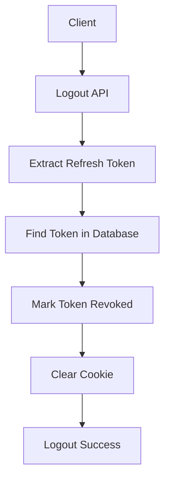

> [!info]
> **Project:** Authentication Service  
> **Section:** API Design  
> **API:** User Logout  
> **Objective:** Design the API responsible for securely terminating user sessions.

---

# 📖 Overview

The Logout API allows authenticated users to end their current session.

During logout:

- Refresh token is invalidated.
- Session is terminated.
- Cookies are cleared.
- Future token refresh requests are rejected.

---

# API Endpoint

## Logout User

```
POST /api/v1/auth/logout
```

---

# Purpose

Invalidate the user's authentication session.

Flow:

```
User

↓

Logout Request

↓

Invalidate Refresh Token

↓

Clear Session

↓

User Logged Out
```

---

# Why Do We Need Logout API?

JWT access tokens are stateless.

Meaning:

Once created:

```
JWT Token

↓

Valid until expiry
```

The server cannot directly delete it.

Example:

```
Access Token Expiry:

15 minutes
```

Even after logout, an access token may remain valid until expiry.

---

# Solution

Invalidate the refresh token.

```
Refresh Token

↓

Database

↓

is_revoked = true
```

Now the user cannot create new access tokens.

---

# Logout Flow



---

# Request

The client sends:

```
Refresh Token
```

Usually stored in:

```
HTTP Only Cookie
```

---

# Request Header

Example:

```http
Cookie:
refreshToken=xxxxxxxx
```

---

# Logout Process

## Step 1: Receive Logout Request

Client sends:

```
POST /api/v1/auth/logout
```

---

## Step 2: Extract Refresh Token

Server gets:

```
refreshToken
```

---

## Step 3: Find Token

Search database:

```
RefreshTokens
```

Example:

```json
{
"user_id":"123",
"token":"hashed_token",
"is_revoked":false
}
```

---

## Step 4: Revoke Token

Update:

Before:

```json
{
"is_revoked":false
}
```

After:

```json
{
"is_revoked":true
}
```

---

## Step 5: Clear Cookie

Remove:

```
refreshToken
```

from browser.

---

# Success Response

HTTP Status:

```
200 OK
```

---

Response:

```json
{
"success":true,
"message":"Logged out successfully"
}
```

---

# Error Responses

---

# 1. Refresh Token Missing

Status:

```
401 Unauthorized
```

Response:

```json
{
"success":false,
"message":"Session not found"
}
```

---

# 2. Invalid Token

Status:

```
401 Unauthorized
```

Response:

```json
{
"success":false,
"message":"Invalid session"
}
```

---

# 3. Server Error

Status:

```
500 Internal Server Error
```

Response:

```json
{
"success":false,
"message":"Internal server error"
}
```

---

# Logout Architecture Flow

```text
Client

↓

Auth Route

↓

Logout Controller

↓

Auth Service

↓

Refresh Token Repository

↓

Database

↓

Clear Cookie

↓

Response
```

---

# Layer Responsibilities

## Controller Layer

Responsible for:

- Receiving logout request.
- Sending response.

---

## Service Layer

Responsible for:

- Finding refresh token.
- Revoking session.

---

## Repository Layer

Responsible for:

Database operations:

```
Find Token

Update Token Status
```

---

# Database Update

Before logout:

```
RefreshTokens

-----------------

token_id:123

is_revoked:false
```

---

After logout:

```
RefreshTokens

-----------------

token_id:123

is_revoked:true
```

---

# Multiple Device Logout

Example:

User logged in from:

```
Laptop

Mobile

Tablet
```

Database:

```
Token 1

Token 2

Token 3
```

---

## Logout Current Device

Only revoke:

```
Current Token
```

---

## Logout All Devices

Revoke:

```
All User Tokens
```

Example:

```
UPDATE RefreshTokens

SET is_revoked=true

WHERE user_id=123
```

---

# Security Considerations

## 1. Always Revoke Refresh Tokens

Do not only clear frontend cookies.

Bad:

```
Clear Cookie Only
```

Because database token still exists.

---

## 2. Handle Expired Tokens

Expired tokens can be cleaned periodically.

---

## 3. Audit Logout Events

Production systems may track:

```
User ID

Time

Device

IP Address
```

---

# Testing Scenarios

---

## Successful Logout

Input:

```
Valid refresh token
```

Expected:

```
200 OK
```

---

## Invalid Token

Input:

```
Invalid refresh token
```

Expected:

```
401 Unauthorized
```

---

## Already Revoked Token

Input:

```
Revoked token
```

Expected:

```
401 Unauthorized
```

---

# Future Implementation Files

During coding:

```
src/

controllers/

auth.controller.ts


services/

auth.service.ts


repositories/

refreshToken.repository.ts


middleware/

auth.middleware.ts
```

---

# 📝 Summary

The Logout API securely terminates user sessions.

Flow:

```
Receive Logout Request

↓

Find Refresh Token

↓

Revoke Token

↓

Clear Cookie

↓

Session Terminated
```

---

# 🧠 Key Takeaways

- Logout requires token invalidation.
- JWT access tokens cannot be deleted directly.
- Refresh tokens should be revoked.
- Cookies should be cleared.
- Session management is important for security.

---

# 🔗 Related Notes

- [[01 - API Overview]]
- [[03 - Login API]]
- [[04 - Refresh Token API]]
- [[06 - Cookie Strategy]]
- [[05 - Refresh Token Design]]
- [[01 - Authentication Flow]]