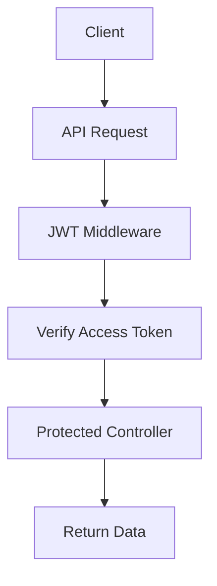

> [!info]
> **Project:** Authentication Service  
> **Section:** API Design  
> **API:** Protected Resources  
> **Objective:** Design APIs that require authentication before access.

---

# 📖 Overview

Protected routes are APIs that can only be accessed by authenticated users.

The server verifies the user's identity before allowing access.

Example:

Public API:

```
POST /api/v1/auth/login
```

Anyone can access.

---

Protected API:

```
GET /api/v1/users/profile
```

Only authenticated users can access.

---

# Why Do We Need Protected Routes?

Without protection:

```
Any User

↓

GET /profile

↓

Private Data Exposed
```

---

With authentication:

```
Request

↓

Verify JWT

↓

Allow / Reject Access
```

---

# Authentication Flow



---

# Protected API Endpoint

## Get User Profile

```
GET /api/v1/users/profile
```

---

# Purpose

Returns information about the currently authenticated user.

---

# Request

Client sends:

```
Access Token
```

---

# Authorization Header

Format:

```http
Authorization: Bearer access_token
```

Example:

```http
Authorization: Bearer eyJhbGciOiJIUzI1...
```

---

# Request Lifecycle

Complete flow:

```
Client

↓

Send Request

↓

JWT Middleware

↓

Extract Token

↓

Verify Token

↓

Attach User Information

↓

Controller

↓

Service

↓

Database

↓

Response
```

---

# JWT Middleware Responsibility

The middleware performs authentication.

Responsibilities:

- Extract JWT.
- Verify token signature.
- Check expiry.
- Decode payload.
- Attach user information.

---

Example JWT Payload:

```json
{
"userId":"123",
"email":"john@gmail.com",
"role":"USER"
}
```

---

After verification:

Request becomes:

```javascript
req.user = {
id:"123",
role:"USER"
}
```

---

# Success Response

HTTP Status:

```
200 OK
```

---

Response:

```json
{
"success":true,
"message":"Profile fetched successfully",
"data":{
"id":"123",
"name":"John Doe",
"email":"john@gmail.com",
"role":"USER"
}
}
```

---

# Authentication Failure Responses

---

# 1. Missing Token

Request:

```
No Authorization Header
```

Response:

Status:

```
401 Unauthorized
```

Body:

```json
{
"success":false,
"message":"Access token required"
}
```

---

# 2. Invalid Token

Example:

Token modified by attacker.

Response:

```
401 Unauthorized
```

---

# 3. Expired Token

Example:

```
Access token expired
```

Response:

```
401 Unauthorized
```

---

# Authentication vs Authorization

Important difference:

---

# Authentication

Question:

```
Who are you?
```

Example:

Login:

```
Email + Password

↓

Identity Verified
```

---

# Authorization

Question:

```
What can you access?
```

Example:

```
ADMIN

↓

Delete User


USER

↓

View Profile
```

---

# Protected Route Levels

Our system has:

## Level 1: Authentication

Check:

```
Is user logged in?
```

Middleware:

```
auth.middleware.ts
```

---

## Level 2: Authorization

Check:

```
Does user have permission?
```

Middleware:

```
role.middleware.ts
```

---

# Example Protected Routes

## User Profile

```
GET /api/v1/users/profile
```

Access:

```
USER

ADMIN

MANAGER
```

---

## Admin Dashboard

```
GET /api/v1/admin/dashboard
```

Access:

```
ADMIN Only
```

---

# Route Flow

Example:

```
GET /admin/dashboard


Client

↓

JWT Middleware

↓

Role Middleware

↓

Admin Controller

↓

Response
```

---

# Security Considerations

## 1. Never Trust Client Data

Client can modify:

```json
{
"role":"ADMIN"
}
```

Never accept role from request.

Use:

```
Database Role
```

---

## 2. Validate JWT

Always check:

- Signature.
- Expiry.
- Issuer.

---

## 3. Secure Token Storage

Prefer:

```
HTTP Only Cookie
```

for refresh tokens.

---

# Future Implementation Files

During coding:

```
src/

middleware/

auth.middleware.ts


middleware/

authorization.middleware.ts


routes/

user.routes.ts


controllers/

user.controller.ts
```

---

# Testing Scenarios

---

## Valid Access Token

Request:

```
GET /profile

Authorization: Bearer token
```

Expected:

```
200 OK
```

---

## Missing Token

Expected:

```
401 Unauthorized
```

---

## Expired Token

Expected:

```
401 Unauthorized
```

---

## Wrong Role

Example:

USER accessing ADMIN API.

Expected:

```
403 Forbidden
```

---

# 📝 Summary

Protected routes ensure that private APIs are accessible only by authenticated users.

Flow:

```
Request

↓

JWT Verification

↓

User Identification

↓

Authorization Check

↓

Controller Access
```

---

# 🧠 Key Takeaways

- Protected routes require authentication.
- JWT middleware verifies users.
- Authentication identifies users.
- Authorization controls permissions.
- Never trust client-provided roles.
- Middleware protects APIs before controllers.

---

# 🔗 Related Notes

- [[01 - API Overview]]
- [[03 - Login API]]
- [[03 - JWT Design]]
- [[07 - RBAC Design]]
- [[03 - Authorization Middleware]]
- [[02 - Request Lifecycle]]