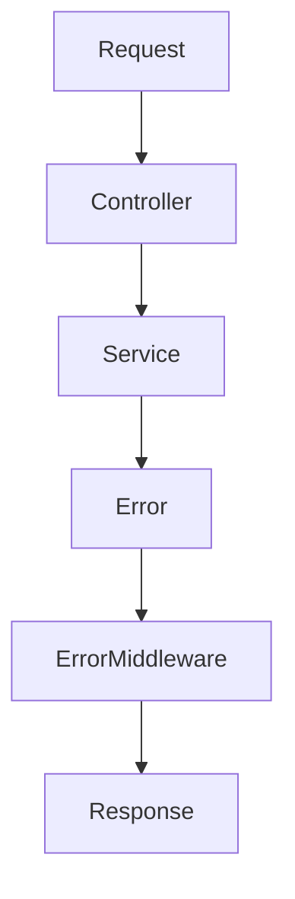

> [!info]
> **Project:** Authentication Service  
> **Section:** API Design  
> **Document Type:** Error Handling Standard  
> **Objective:** Define consistent error responses across all APIs.

---

# 📖 Overview

Errors are expected situations in backend systems.

Examples:

- Invalid user input.
- Wrong credentials.
- Expired tokens.
- Database failures.
- Server problems.

A good API should return errors in a consistent format.

---

# Error Response Goals

Our error handling should be:

- Consistent.
- Easy to understand.
- Secure.
- Developer friendly.
- Safe for production.

---

# Standard Error Response Format

All APIs follow this structure:

```json
{
"success":false,
"message":"Error message",
"errorCode":"ERROR_CODE",
"errors":[]
}
```

---

# Example

```json
{
"success":false,
"message":"Validation failed",
"errorCode":"VALIDATION_ERROR",
"errors":[
"Email is required",
"Password is too weak"
]
}
```

---

# Response Fields

| Field | Description |
|-|-|
| success | Indicates request status |
| message | Human readable message |
| errorCode | Programmatic error identifier |
| errors | Detailed validation errors |

---

# HTTP Status Code Strategy

We use standard HTTP status codes.

---

# 400 Bad Request

## Meaning

Client sent invalid data.

Examples:

- Missing fields.
- Invalid format.
- Validation failure.

---

Example:

Request:

```json
{
"email":"wrong-email"
}
```

Response:

```json
{
"success":false,
"message":"Validation failed",
"errorCode":"VALIDATION_ERROR"
}
```

---

# 401 Unauthorized

## Meaning

Authentication failed.

Examples:

- Invalid credentials.
- Missing JWT.
- Expired token.

---

Example:

```json
{
"success":false,
"message":"Invalid credentials",
"errorCode":"AUTH_ERROR"
}
```

---

# 403 Forbidden

## Meaning

User is authenticated but does not have permission.

Example:

```
USER accessing ADMIN API
```

---

Response:

```json
{
"success":false,
"message":"Access denied",
"errorCode":"FORBIDDEN"
}
```

---

# 404 Not Found

## Meaning

Requested resource does not exist.

Example:

```
User not found
```

---

Response:

```json
{
"success":false,
"message":"Resource not found",
"errorCode":"NOT_FOUND"
}
```

---

# 409 Conflict

## Meaning

Request conflicts with existing data.

Example:

```
Email already registered
```

---

Response:

```json
{
"success":false,
"message":"Email already exists",
"errorCode":"DUPLICATE_RESOURCE"
}
```

---

# 500 Internal Server Error

## Meaning

Unexpected server failure.

Examples:

- Database crash.
- Unknown exception.

---

Response:

```json
{
"success":false,
"message":"Internal server error",
"errorCode":"SERVER_ERROR"
}
```

---

# Authentication Error Handling

Authentication failures should not reveal sensitive information.

---

Bad Response:

```json
{
"message":"Email does not exist"
}
```

Problem:

Attackers can discover registered emails.

---

Good Response:

```json
{
"message":"Invalid credentials"
}
```

---

# Validation Error Handling

Input validation happens before business logic.

Example:

Request:

```json
{
"email":"",
"password":"123"
}
```

Response:

```json
{
"success":false,
"message":"Validation failed",
"errorCode":"VALIDATION_ERROR",
"errors":[
"Email is required",
"Password must contain 8 characters"
]
}
```

---

# Database Error Handling

Database errors should not expose internal details.

---

Bad:

```json
{
"message":"MongoError duplicate key index users.email"
}
```

---

Good:

```json
{
"message":"Unable to process request"
}
```

---

# Error Flow Architecture



---

# Centralized Error Handling

Instead of handling errors everywhere:

Example:

Bad:

```javascript
try {

}
catch(error){

sendResponse()

}
```

in every controller.

---

Better:

```
Controller

↓

Throw Error

↓

Global Error Middleware

↓

Response
```

---

# Error Categories

## Client Errors

Caused by user input.

Examples:

```
400

401

403

404

409
```

---

## Server Errors

Caused by backend problems.

Example:

```
500
```

---

# Security Rules

## Never Return:

Passwords:

```
password
password_hash
```

---

Tokens:

```
JWT secret
Refresh token data
```

---

Database Information:

```
SQL queries
Stack traces
```

---

# Logging Errors

Production systems should log:

- Error message.
- Timestamp.
- Request path.
- User ID (if available).
- Stack trace internally.

---

Do not log:

```
Passwords

JWT Tokens

Sensitive Information
```

---

# Example Complete Error Flow

Scenario:

User enters wrong password.

```
Client

↓

POST /login

↓

Controller

↓

Auth Service

↓

Password Comparison Failed

↓

Throw Authentication Error

↓

Error Middleware

↓

401 Response
```

---

# API Error Examples

---

## Login Failure

```json
{
"success":false,
"message":"Invalid credentials",
"errorCode":"AUTH_ERROR"
}
```

---

## Token Expired

```json
{
"success":false,
"message":"Token expired",
"errorCode":"TOKEN_EXPIRED"
}
```

---

## Permission Denied

```json
{
"success":false,
"message":"Insufficient permissions",
"errorCode":"FORBIDDEN"
}
```

---

# 📝 Summary

A consistent error system improves:

- Debugging.
- Client integration.
- Security.
- Maintainability.

Our API follows:

```
Request

↓

Validation

↓

Business Logic

↓

Error Handling Middleware

↓

Standard Response
```

---

# 🧠 Key Takeaways

- Always use consistent error formats.
- Use correct HTTP status codes.
- Never expose sensitive information.
- Centralize error handling.
- Separate client errors and server errors.
- Log errors safely.

---

# 🔗 Related Notes

- [[01 - API Overview]]
- [[06 - Protected Routes API]]
- [[Error Handling Architecture]]
- [[Express Error Middleware]]
- [[Logging System]]