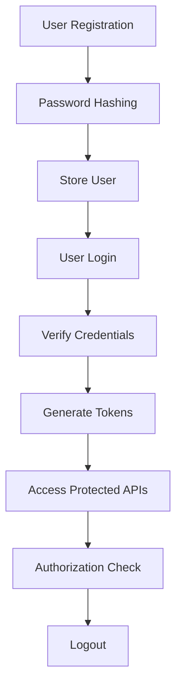

> [!info]
> **Project:** Authentication Service  
> **Section:** Authentication Design  
> **Document Type:** Authentication Architecture  
> **Objective:** Understand the complete authentication lifecycle.

---

# 📖 Overview

Authentication is the process of verifying the identity of a user.

The system answers:

```
Who are you?
```

Example:

A user enters:

```
Email

+

Password
```

The backend verifies whether the user is genuine.

---

# Authentication vs Authorization

These two concepts are different.

---

# Authentication

Purpose:

```
Verify Identity
```

Question:

```
Who are you?
```

Example:

```
Login with email and password
```

---

# Authorization

Purpose:

```
Check Permissions
```

Question:

```
What can you access?
```

Example:

```
ADMIN can delete users

USER cannot
```

---

# Complete Authentication Lifecycle



---

# Phase 1: User Registration

User provides:

```json
{
"name":"John",
"email":"john@gmail.com",
"password":"Password@123"
}
```

---

Backend performs:

```
Validate Input

↓

Hash Password

↓

Store User
```

---

Important:

Original password:

```
Password@123
```

is never stored.

Database stores:

```
$2b$10$8hd73....
```

---

# Phase 2: User Login

User sends:

```json
{
"email":"john@gmail.com",
"password":"Password@123"
}
```

---

Backend:

```
Find User

↓

Compare Password Hash

↓

Generate Tokens
```

---

# Phase 3: Token Generation

After successful login:

Server creates:

```
Access Token

+

Refresh Token
```

---

Access Token:

Purpose:

```
Access Protected APIs
```

Example:

```
GET /profile
```

---

Refresh Token:

Purpose:

```
Generate New Access Tokens
```

---

# Phase 4: Access Protected Resources

Client sends:

```http
Authorization: Bearer access_token
```

---

Backend:

```
Receive Request

↓

Verify JWT

↓

Identify User

↓

Allow Access
```

---

# Phase 5: Authorization

After authentication:

System checks permissions.

Example:

Request:

```
DELETE /users/123
```

---

Check:

```
User Role = ADMIN?
```

If yes:

```
Allow
```

If no:

```
Reject
```

---

# Phase 6: Logout

When user logs out:

```
Refresh Token Revoked

↓

Cookie Cleared

↓

Session Terminated
```

---

# Authentication Architecture

```text
Client

↓

Express API

↓

Authentication Middleware

↓

Controller

↓

Auth Service

↓

User Repository

↓

Database
```

---

# Component Responsibilities

## Client

Responsible for:

- Sending credentials.
- Storing tokens safely.
- Sending authenticated requests.

---

## Authentication Controller

Responsible for:

- Receiving requests.
- Returning responses.

Examples:

```
register()

login()

logout()
```

---

## Authentication Service

Responsible for:

Business logic:

- Verify user.
- Hash password.
- Generate tokens.

---

## User Repository

Responsible for:

Database operations:

```
Create User

Find User

Update User
```

---

## Token Service

Responsible for:

- Create JWT.
- Verify JWT.
- Manage expiry.

---

# Authentication Data Flow

## Registration

```
User Data

↓

Validation

↓

Password Hashing

↓

Database

↓

Success Response
```

---

## Login

```
Credentials

↓

Find User

↓

Compare Password

↓

Generate JWT

↓

Return Tokens
```

---

## Protected Request

```
Request

↓

JWT Middleware

↓

Verify Token

↓

Attach User

↓

Controller
```

---

# Security Principles

## 1. Never Store Plain Passwords

Bad:

```
password123
```

Good:

```
hashed_password
```

---

## 2. Short-lived Access Tokens

Example:

```
15 minutes
```

---

## 3. Secure Refresh Tokens

Use:

```
HTTP Only Cookie
```

---

## 4. Validate Every Request

Never trust client input.

---

# Authentication Components

Our system contains:

```
Password Hashing

+

JWT

+

Refresh Tokens

+

Cookies

+

RBAC

+

Session Management
```

---

# 📝 Summary

Authentication Service workflow:

```
Register

↓

Hash Password

↓

Store User

↓

Login

↓

Verify Identity

↓

Generate Tokens

↓

Access Protected APIs

↓

Authorize User

↓

Logout
```

---

# 🧠 Key Takeaways

- Authentication verifies identity.
- Authorization controls access.
- Passwords must be hashed.
- JWT proves identity after login.
- Refresh tokens maintain sessions.
- Middleware protects APIs.

---

# 🔗 Related Notes

- [[02 - Password Hashing]]
- [[03 - JWT Design]]
- [[04 - Access Token Design]]
- [[05 - Refresh Token Design]]
- [[07 - RBAC Design]]