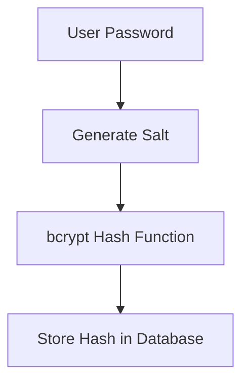

> [!info]
> **Project:** Authentication Service  
> **Section:** Authentication Design  
> **Document Type:** Security Design  
> **Objective:** Understand secure password storage using hashing.

---

# 📖 Overview

Password hashing is the process of converting a user's password into a fixed-length encrypted-looking value.

Example:

Original password:

```
Password@123
```

↓

Hash Function:

```
bcrypt
```

↓

Stored value:

```
$2b$10$8x7H3kL9sJ2....
```

The original password cannot be recovered.

---

# Why Do We Need Password Hashing?

A database stores user information.

Example:

```
Users Table

id
name
email
password
```

If we store:

```
password = Password@123
```

and the database is leaked:

```
Attacker gets all user passwords
```

This is a serious security problem.

---

# Never Store Plain Text Passwords

❌ Wrong:

```json
{
"email":"john@gmail.com",
"password":"Password@123"
}
```

---

✅ Correct:

```json
{
"email":"john@gmail.com",
"password_hash":"$2b$10$8x73..."
}
```

---

# Hashing vs Encryption

Many beginners confuse these concepts.

---

# Hashing

Purpose:

```
Protect passwords
```

Properties:

- One-way process.
- Cannot be reversed.
- Same input produces same output (with same salt).

Example:

```
Password

↓

Hash

↓

Unknown value
```

Used for:

- Password storage.

---

# Encryption

Purpose:

```
Protect data that needs to be recovered
```

Properties:

- Two-way process.
- Can be decrypted using a key.

Example:

```
Message

↓

Encryption

↓

Encrypted Data

↓

Decryption

↓

Original Message
```

Used for:

- Secure communication.
- Sensitive data storage.

---

# Why We Use Hashing for Passwords?

Because the server does not need to know the original password.

During login:

User enters:

```
Password@123
```

Server only checks:

```
Does this password create the same hash?
```

---

# Password Hashing Algorithm

Our project uses:

```
bcrypt
```

---

# What is bcrypt?

bcrypt is a password hashing algorithm designed specifically for storing passwords securely.

Features:

- Slow by design.
- Uses salt.
- Resistant to brute force attacks.

---

# bcrypt Flow



---

# What is Salt?

Salt is a random value added to the password before hashing.

Example:

Without salt:

```
Password123

↓

hash123
```

Two users with same password:

```
User A:

Password123

↓

hash123


User B:

Password123

↓

hash123
```

Problem:

Attacker can identify common passwords.

---

With salt:

```
Password123 + randomSalt

↓

different hash
```

Result:

```
User A:

$2b$10$abc...


User B:

$2b$10$xyz...
```

Same password produces different hashes.

---

# bcrypt Salt Rounds

bcrypt uses cost factor.

Example:

```
10 rounds
```

Higher rounds:

```
More security

+

More processing time
```

---

Typical values:

```
10 - 12 rounds
```

---

# Registration Flow

When a user registers:

```
User enters password

↓

Validate password

↓

Generate bcrypt hash

↓

Store hash

↓

Remove original password
```

---

Example:

Input:

```json
{
"password":"Password@123"
}
```

---

Hash:

```
$2b$10$7Hk29....
```

---

Database:

```json
{
"password_hash":"$2b$10$7Hk29..."
}
```

---

# Login Flow

During login:

User enters:

```
Password@123
```

Database contains:

```
$2b$10$7Hk29....
```

---

bcrypt performs:

```
bcrypt.compare(
enteredPassword,
storedHash
)
```

---

Result:

If match:

```
Authentication Success
```

If not:

```
Authentication Failed
```

---

# Password Hashing Architecture

```text
Register API

↓

Auth Service

↓

bcrypt.hash()

↓

Database


Login API

↓

Auth Service

↓

bcrypt.compare()

↓

Authentication Result
```

---

# Implementation Package

Node.js package:

```
bcrypt
```

Install:

```bash
npm install bcrypt
```

TypeScript types:

```bash
npm install -D @types/bcrypt
```

---

# Security Rules

## Rule 1: Never Log Passwords

Bad:

```javascript
console.log(password)
```

---

## Rule 2: Never Return Password Hash

Bad response:

```json
{
"password_hash":"$2b$10..."
}
```

---

## Rule 3: Validate Password Strength

Example rules:

```
Minimum 8 characters

One uppercase

One lowercase

One number

One special character
```

---

# Common Password Attacks

## 1. Brute Force Attack

Attacker tries:

```
password1

password2

password3
```

Protection:

- bcrypt slow hashing.
- Rate limiting.

---

## 2. Rainbow Table Attack

Attacker uses precomputed hashes.

Protection:

- Salt.

---

## 3. Database Leak

Attacker gets database.

Protection:

- Strong hashing algorithm.
- No plain passwords.

---

# Testing Scenarios

## Register User

Input:

```
Password@123
```

Expected:

Database contains:

```
hashed password
```

---

## Login Correct Password

Input:

```
Password@123
```

Expected:

```
bcrypt.compare = true
```

---

## Login Wrong Password

Input:

```
WrongPassword
```

Expected:

```
bcrypt.compare = false
```

---

# 📝 Summary

Password hashing protects user credentials.

Flow:

```
Plain Password

↓

bcrypt + Salt

↓

Password Hash

↓

Database Storage
```

During login:

```
Entered Password

↓

bcrypt.compare()

↓

Allow / Reject Login
```

---

# 🧠 Key Takeaways

- Never store plain passwords.
- Hashing is one-way.
- bcrypt is designed for passwords.
- Salt prevents identical password hashes.
- Password verification uses comparison, not decryption.
- Password security is the foundation of authentication.

---

# 🔗 Related Notes

- [[01 - Authentication Flow]]
- [[03 - JWT Design]]
- [[03 - Login API]]
- [[02 - Register API]]
- [[Security Best Practices]]