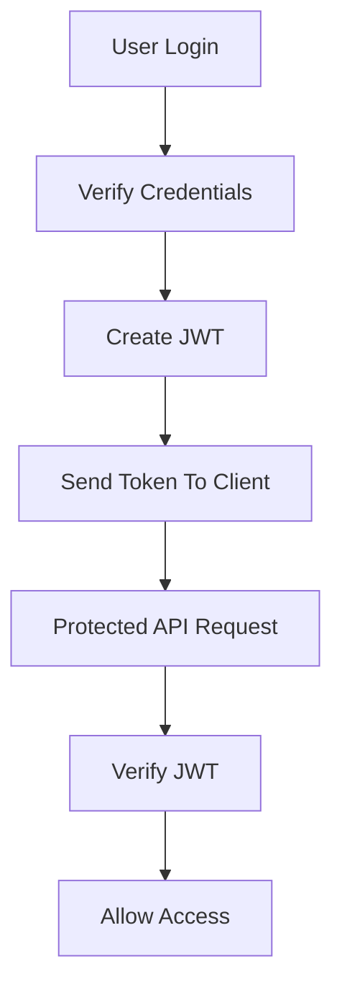

> [!info]
> **Project:** Authentication Service  
> **Section:** Authentication Design  
> **Document Type:** Token Architecture  
> **Objective:** Understand JSON Web Token design and implementation.

---

# 📖 Overview

JWT (JSON Web Token) is a standard used to securely transfer information between parties as a JSON object.

In our Authentication Service, JWT is used to:

- Identify authenticated users.
- Protect API routes.
- Carry user information.
- Support stateless authentication.

---

# What Problem Does JWT Solve?

Without JWT:

Every request requires:

```
Client

↓

Send Username + Password

↓

Server Verify

↓

Allow Access
```

Problem:

- More database queries.
- Poor scalability.
- Bad user experience.

---

# With JWT

After login:

```
User Login

↓

Server Creates JWT

↓

Client Stores Token

↓

Client Sends Token With Requests

↓

Server Verifies Token
```

The server does not need to store session data.

---

# JWT Architecture



---

# JWT Structure

A JWT contains three parts:

```
Header.Payload.Signature
```

Example:

```
xxxxx.yyyyy.zzzzz
```

---

# 1. Header

The header contains information about the token.

Example:

```json
{
"alg":"HS256",
"typ":"JWT"
}
```

---

Fields:

## alg

Algorithm used for signing.

Example:

```
HS256
```

---

## typ

Token type.

Example:

```
JWT
```

---

# 2. Payload

Payload contains claims (information).

Example:

```json
{
"userId":"123",
"email":"john@gmail.com",
"role":"USER",
"iat":1721800000,
"exp":1721800900
}
```

---

Common Claims:

| Claim | Meaning |
|-|-|
| sub | Subject/User ID |
| iat | Issued At |
| exp | Expiration Time |
| role | User Role |

---

# Important

JWT payload is NOT encrypted.

Anyone can decode it.

Example:

```
JWT

↓

Base64 Decode

↓

Payload Data
```

Therefore:

Never store:

```
Password

Secret Keys

Sensitive Information
```

inside JWT.

---

# 3. Signature

The signature verifies that the token was created by our server.

Formula:

```
Signature =

Header

+

Payload

+

Secret Key
```

Example:

```
HMACSHA256(
header.payload,
secret
)
```

---

# JWT Creation Flow

During login:

```
User Credentials

↓

Password Verification

↓

Create Payload

↓

Sign With Secret Key

↓

Generate JWT

↓

Return Token
```

---

# JWT Verification Flow

When user accesses protected API:

Request:

```http
Authorization: Bearer token
```

---

Backend:

```
Receive Token

↓

Split Header.Payload.Signature

↓

Verify Signature

↓

Check Expiry

↓

Extract User Information

↓

Allow Request
```

---

# JWT Example

Token:

```
eyJhbGciOiJIUzI1...
```

Decoded:

Header:

```json
{
"alg":"HS256"
}
```

Payload:

```json
{
"userId":"123",
"role":"USER"
}
```

Signature:

```
Verified by Server
```

---

# JWT Authentication Flow

Complete flow:

```text
Client

↓

Login API

↓

Auth Service

↓

Verify Password

↓

Generate JWT

↓

Return Token


Later:


Client

↓

Protected API

↓

JWT Middleware

↓

Verify Token

↓

Controller
```

---

# Stateless Authentication

JWT enables stateless authentication.

Meaning:

Server does not store:

```
Session ID

User Login State
```

Every request contains:

```
JWT Token
```

Server verifies it.

---

# Stateful vs Stateless Authentication

## Stateful

Server stores session.

Example:

```
User ID

Session ID

Login Time
```

Database:

```
Sessions Table
```

---

## Stateless

Server stores nothing.

Client sends:

```
JWT Token
```

Every request.

---

# Why Use JWT in This Project?

Advantages:

## Scalability

Multiple servers can verify tokens.

---

## Performance

Less session database lookup.

---

## Microservice Friendly

Different services can verify same token.

---

# JWT Security Considerations

## 1. Use Strong Secret Key

Bad:

```
secret123
```

Good:

```
Long random secret key
```

---

## 2. Set Expiry

Example:

```
15 minutes
```

Never create unlimited tokens.

---

## 3. Validate Signature

Never trust decoded payload directly.

---

## 4. Use HTTPS

Prevent token interception.

---

## 5. Avoid Sensitive Data

Never include:

```
Password

Credit Card

Private Information
```

---

# JWT Libraries

Node.js package:

```
jsonwebtoken
```

Install:

```bash
npm install jsonwebtoken
```

TypeScript:

```bash
npm install -D @types/jsonwebtoken
```

---

# JWT Configuration

Environment variables:

Example:

```
JWT_ACCESS_SECRET=my_secret_key

JWT_ACCESS_EXPIRES=15m
```

---

# JWT Components in Our Project

We will create:

```
Token Service

↓

Generate JWT

↓

Verify JWT
```

---

# Future Implementation Files

During coding:

```
src/

utils/

jwt.ts


services/

token.service.ts


middleware/

auth.middleware.ts
```

---

# Testing Scenarios

## Valid Token

Input:

```
Correct JWT
```

Expected:

```
Access Granted
```

---

## Expired Token

Input:

```
Expired JWT
```

Expected:

```
401 Unauthorized
```

---

## Modified Token

Input:

```
Changed Payload
```

Expected:

```
401 Unauthorized
```

---

# 📝 Summary

JWT provides secure identity verification.

Flow:

```
Login

↓

Create JWT

↓

Client Stores Token

↓

Send Token

↓

Verify Signature

↓

Access Resource
```

---

# 🧠 Key Takeaways

- JWT proves user identity.
- JWT has Header, Payload, Signature.
- Payload is readable, not encrypted.
- Signature prevents modification.
- JWT enables stateless authentication.
- Never store sensitive data inside tokens.
- Always set token expiry.

---

# 🔗 Related Notes

- [[01 - Authentication Flow]]
- [[02 - Password Hashing]]
- [[04 - Access Token Design]]
- [[05 - Refresh Token Design]]
- [[06 - Protected Routes API]]