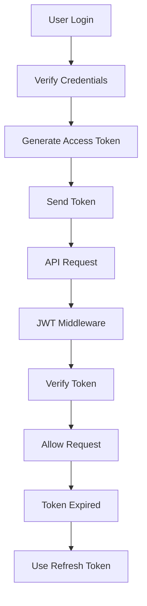

# 04 - Access Token Design

> [!info]
> **Project:** Authentication Service  
> **Section:** Authentication Design  
> **Document Type:** Token Architecture  
> **Objective:** Define how access tokens are created, used, and validated.

---

# 📖 Overview

An Access Token is a short-lived token used to authenticate API requests.

After successful login, the server generates an access token.

The client sends this token whenever accessing protected resources.

---

# Purpose of Access Token

The access token answers:

```
Is this request coming from an authenticated user?
```

Example:

User wants:

```
GET /api/v1/users/profile
```

The server checks:

```
Is the access token valid?
```

If yes:

```
Allow Access
```

---

# Access Token Lifecycle



---

# Access Token Flow

Complete flow:

```
User Login

↓

Password Verified

↓

Create Access Token

↓

Send To Client

↓

Client Stores Token

↓

Send With API Requests

↓

Backend Verifies Token

↓

Allow Access
```

---

# Access Token Structure

Access token is a JWT.

Example payload:

```json
{
"userId":"123",
"email":"john@gmail.com",
"role":"USER",
"iat":1721800000,
"exp":1721800900
}
```

---

# Payload Design

Our access token contains:

| Field | Purpose |
|-|-|
| userId | Identify user |
| email | User reference |
| role | Authorization |
| iat | Token creation time |
| exp | Expiry time |

---

# Why Store User ID?

Instead of sending:

```
Email + Password
```

every request:

We send:

```
userId
```

inside token.

Example:

```json
{
"userId":"123"
}
```

Backend can identify the user.

---

# Access Token Expiry

Access tokens should be short-lived.

Example:

```
15 minutes
```

---

Why?

If stolen:

```
Attacker can use token
```

Short expiry reduces damage.

---

# Access Token vs Refresh Token

| Feature | Access Token | Refresh Token |
|-|-|-|
| Purpose | Access APIs | Generate new tokens |
| Lifetime | Short | Long |
| Example | 15 minutes | 7 days |
| Storage | Memory / Secure Storage | HTTP Only Cookie |
| Database | Usually No | Yes |

---

# Access Token Generation

During login:

```
User Login

↓

Verify Password

↓

Create Payload

↓

Sign JWT

↓

Return Access Token
```

---

Example:

```javascript
jwt.sign(
{
 userId:user.id,
 role:user.role
},
ACCESS_SECRET,
{
 expiresIn:"15m"
}
)
```

---

# Access Token Usage

Client request:

```http
GET /api/v1/users/profile
```

Header:

```http
Authorization: Bearer access_token
```

---

Example:

```http
Authorization: Bearer eyJhbGciOiJIUzI1...
```

---

# Access Token Verification

Every protected request follows:

```
Request

↓

Extract Token

↓

Verify Signature

↓

Check Expiry

↓

Decode Payload

↓

Attach User

↓

Continue Request
```

---

# JWT Middleware

The middleware handles verification.

Example:

```
auth.middleware.ts
```

Responsibilities:

- Read Authorization header.
- Extract token.
- Verify JWT.
- Attach user information.

---

Example:

Before middleware:

```javascript
req.user
```

does not exist.

---

After middleware:

```javascript
req.user = {
 id:"123",
 role:"USER"
}
```

---

# Access Token Security

## 1. Short Expiry

Use:

```
15 minutes
```

---

## 2. Strong Secret

Example:

Environment variable:

```
ACCESS_TOKEN_SECRET
```

---

## 3. HTTPS

Always transmit tokens securely.

---

## 4. Do Not Store Sensitive Data

Never include:

```
Password

Credit Card

Private Information
```

---

# Access Token Storage

Possible locations:

---

## Browser Memory

Advantages:

- More secure against XSS.

Disadvantage:

- Lost on refresh.

---

## Local Storage

Easy but risky.

Problem:

```
XSS attack can steal token
```

---

## HTTP Only Cookie

More secure.

JavaScript cannot access it.

---

For our project:

```
Refresh Token

↓

HTTP Only Cookie
```

Access token:

```
Client Memory
```

---

# Access Token Failure Cases

---

## Missing Token

Example:

```
No Authorization Header
```

Response:

```
401 Unauthorized
```

---

## Invalid Token

Example:

```
Signature mismatch
```

Response:

```
401 Unauthorized
```

---

## Expired Token

Example:

```
Token expired
```

Response:

```
401 Unauthorized
```

---

# Implementation Files

During coding:

```
src/

services/

token.service.ts


middleware/

auth.middleware.ts


config/

jwt.config.ts
```

---

# Testing Scenarios

## Valid Token

Request:

```
Authorization: Bearer valid_token
```

Expected:

```
Access Granted
```

---

## Expired Token

Expected:

```
401 Unauthorized
```

---

## Modified Token

Expected:

```
401 Unauthorized
```

---

# 📝 Summary

Access Token provides temporary access to protected APIs.

Flow:

```
Login

↓

Generate Access Token

↓

Send With Request

↓

Verify JWT

↓

Allow Access
```

---

# 🧠 Key Takeaways

- Access tokens authenticate API requests.
- Access tokens are short-lived.
- Access tokens are usually JWTs.
- Middleware verifies tokens.
- Never store sensitive information inside tokens.
- Expired tokens are replaced using refresh tokens.

---

# 🔗 Related Notes

- [[03 - JWT Design]]
- [[05 - Refresh Token Design]]
- [[06 - Cookie Strategy]]
- [[06 - Protected Routes API]]
- [[01 - Authentication Flow]]