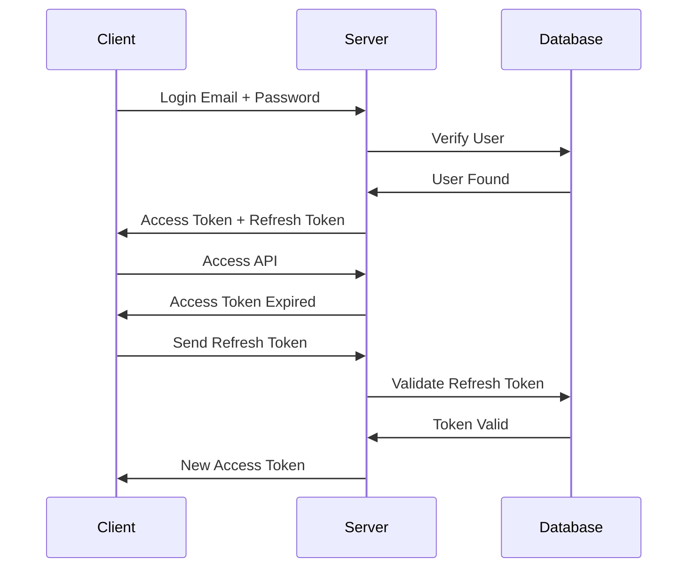
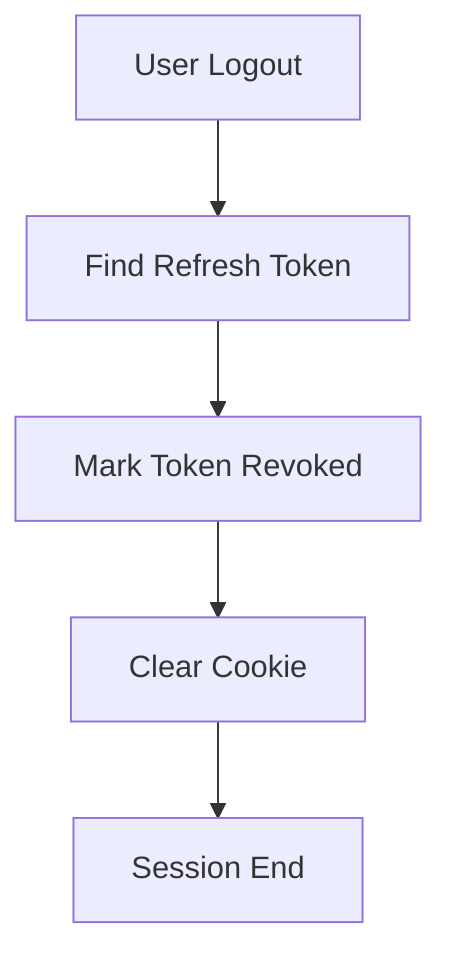

> [!info]
> **Project:** Authentication Service  
> **Section:** Authentication Design  
> **Document Type:** Token Architecture  
> **Objective:** Design a secure refresh token system for maintaining user sessions.

---

# 📖 Overview

A Refresh Token is a long-lived token used to generate a new Access Token after the current access token expires.

It allows users to stay logged in without entering their credentials repeatedly.

---

# Why Do We Need Refresh Tokens?

Access tokens should have short expiry.

Example:

```
Access Token:

15 minutes
```

Problem:

After 15 minutes:

```
Token Expired

↓

User must Login Again
```

This creates a poor user experience.

---

Solution:

```
Access Token

+

Refresh Token
```

---

# Token Relationship

```
Login

↓

Generate

Access Token (15 min)

+

Refresh Token (7 days)

↓

User Uses Application

↓

Access Token Expires

↓

Refresh Token Creates New Access Token
```

---

# Access Token vs Refresh Token

| Feature | Access Token | Refresh Token |
|-|-|-|
| Purpose | Access APIs | Generate new access tokens |
| Lifetime | Short | Long |
| Expiry | Minutes | Days |
| Sent With | Every API request | Refresh API only |
| Stored In DB | No | Yes |
| Sensitive | Medium | High |

---

# Refresh Token Flow



---

# Login Process

User login:

```json
{
"email":"john@gmail.com",
"password":"Password@123"
}
```

---

Backend:

```
Verify Password

↓

Create Access Token

↓

Create Refresh Token

↓

Store Refresh Token

↓

Return Tokens
```

---

# Refresh Token Storage

Refresh tokens are stored in database.

Example table:

```
RefreshTokens
```

---

Database Design:

| Column | Purpose |
|-|-|
| id | Primary key |
| user_id | Token owner |
| token | Refresh token value |
| expires_at | Expiry date |
| is_revoked | Token status |
| created_at | Creation time |

---

Example:

```
RefreshTokens

id: 1

user_id: 123

token: abcxyz123

expires_at: 2026-07-31

is_revoked: false
```

---

# Why Store Refresh Tokens?

Because we need:

- Validation.
- Revocation.
- Logout support.
- Security control.

---

# Refresh Token API

Endpoint:

```
POST /api/v1/auth/refresh
```

---

Request:

```json
{
"refreshToken":"token_value"
}
```

---

Process:

```
Receive Refresh Token

↓

Find Token In Database

↓

Check Expiry

↓

Check Revoked Status

↓

Generate New Access Token

↓

Return Response
```

---

# Refresh Token Rotation

Production systems use token rotation.

Meaning:

Every time refresh token is used:

```
Old Refresh Token

↓

Invalidate

↓

Create New Refresh Token
```

---

Example:

Before:

```
Refresh Token A
```

After refresh:

```
Refresh Token A ❌

Refresh Token B ✅
```

---

# Why Rotation?

Protection against:

```
Stolen Refresh Token
```

If attacker uses old token:

```
Token already revoked

↓

Access Denied
```

---

# Refresh Token Revocation

Revocation means disabling a refresh token.

Example:

Logout:

```
User clicks Logout

↓

Refresh Token revoked

↓

Session ended
```

---

Database:

Before:

```
is_revoked = false
```

After:

```
is_revoked = true
```

---

# Logout Flow



---

# Refresh Token Security

## 1. Store in HTTP Only Cookie

Why?

JavaScript cannot access it.

Protection:

```
XSS attacks
```

---

## 2. Use Secure Cookie

Production:

```
HTTPS only
```

---

## 3. Set Expiry

Example:

```
7 days
```

---

## 4. Hash Refresh Tokens

Optional security improvement.

Instead of storing:

```
Original Token
```

Store:

```
Token Hash
```

---

# Access Token Expired Scenario

Example:

User requests:

```
GET /profile
```

Response:

```
401 Token Expired
```

Client:

```
Call Refresh API
```

Server:

```
Validate Refresh Token

↓

Generate New Access Token

↓

Retry Request
```

---

# Refresh Token Failure Cases

---

## Invalid Refresh Token

Response:

```
401 Unauthorized
```

---

## Expired Refresh Token

Response:

```
401 Session Expired
```

---

## Revoked Refresh Token

Response:

```
401 Token Revoked
```

---

# Implementation Files

During coding:

```
src/

models/

refreshToken.model.ts


services/

token.service.ts


controllers/

auth.controller.ts


routes/

auth.routes.ts
```

---

# Testing Scenarios

## Valid Refresh Token

Expected:

```
New Access Token Generated
```

---

## Expired Refresh Token

Expected:

```
401 Unauthorized
```

---

## Revoked Refresh Token

Expected:

```
401 Unauthorized
```

---

## Reused Old Token

Expected:

```
Access Denied
```

---

# Complete Authentication Session

```
Login

↓

Access Token + Refresh Token

↓

Access APIs

↓

Access Token Expired

↓

Refresh Token Used

↓

New Access Token

↓

Logout

↓

Refresh Token Revoked
```

---

# 📝 Summary

Refresh tokens maintain user sessions securely.

Flow:

```
Access Token Expired

↓

Send Refresh Token

↓

Validate

↓

Generate New Access Token
```

---

# 🧠 Key Takeaways

- Access tokens are short-lived.
- Refresh tokens maintain sessions.
- Refresh tokens are stored securely.
- Database storage enables revocation.
- Rotation improves security.
- Logout revokes refresh tokens.
- Refresh tokens are more sensitive than access tokens.

---

# 🔗 Related Notes

- [[03 - JWT Design]]
- [[04 - Access Token Design]]
- [[06 - Cookie Strategy]]
- [[08 - Session Management]]
- [[05 - Logout API]]