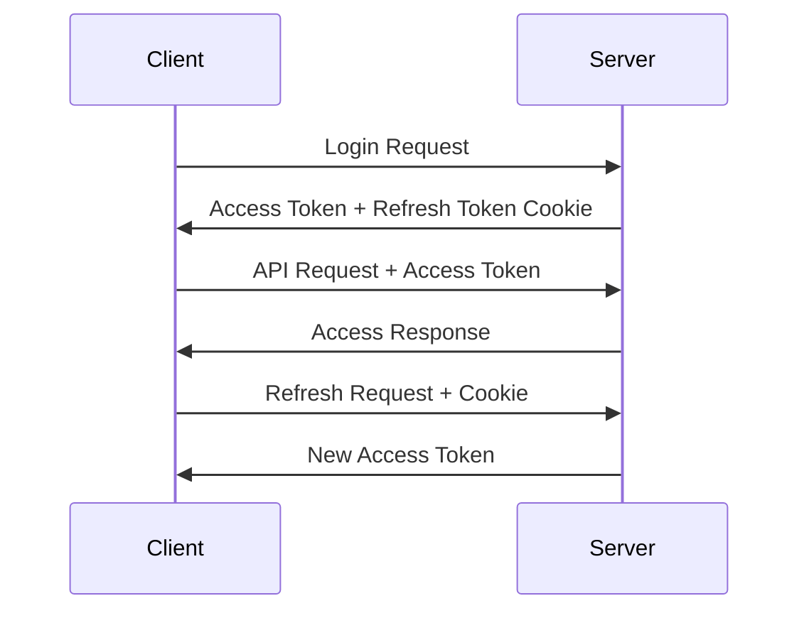

> [!info]
> **Project:** Authentication Service  
> **Section:** Authentication Design  
> **Document Type:** Security Design  
> **Objective:** Define secure cookie usage for authentication tokens.

---

# 📖 Overview

Cookies are small pieces of data stored by the browser and automatically sent with HTTP requests.

In our Authentication Service, cookies are used to securely store refresh tokens.

---

# Why Use Cookies?

After login, the server provides:

```
Access Token

+

Refresh Token
```

The client needs to store these tokens.

Possible storage options:

```
Local Storage

Session Storage

Cookies
```

For sensitive tokens:

```
HTTP Only Cookies
```

are preferred.

---

# Cookie Authentication Flow



---

# Why Store Refresh Token in Cookie?

Refresh tokens are powerful.

If stolen:

```
Attacker

↓

Refresh Token

↓

Generate New Access Tokens
```

Therefore, we need additional protection.

---

# HTTP Only Cookie

## What is HTTP Only?

A cookie with HTTP Only cannot be accessed by JavaScript.

Example:

```javascript
document.cookie
```

will not show it.

---

Protection:

```
XSS Attack

↓

Cannot steal Refresh Token
```

---

# Secure Cookie Flag

The Secure flag ensures cookies are sent only through HTTPS.

Example:

```
secure: true
```

---

Without Secure:

```
HTTP Request

↓

Cookie Sent
```

Risk:

```
Network Attack
```

---

With Secure:

```
HTTPS Request

↓

Cookie Sent
```

---

# SameSite Cookie Policy

SameSite controls when cookies are sent with cross-site requests.

Options:

---

## Strict

```
Cookie only sent from same site
```

Highest security.

---

## Lax

```
Cookie sent in normal navigation
```

Common default.

---

## None

```
Cookie sent everywhere
```

Requires:

```
Secure = true
```

---

# Our Cookie Configuration

Production style:

```javascript
{
httpOnly:true,
secure:true,
sameSite:"strict",
maxAge:7 * 24 * 60 * 60 * 1000
}
```

---

# Cookie Properties

| Property | Purpose |
|-|-|
| httpOnly | Prevent JavaScript access |
| secure | HTTPS only |
| sameSite | CSRF protection |
| maxAge | Expiry time |
| path | Cookie availability |

---

# Refresh Token Cookie Example

Server response:

```http
Set-Cookie:

refreshToken=abc123;

HttpOnly;

Secure;

SameSite=Strict
```

---

# Cookie Lifecycle

```text
Login

↓

Create Refresh Token

↓

Store In Cookie

↓

User Uses Application

↓

Refresh Token Sent Automatically

↓

New Access Token Generated

↓

Logout

↓

Cookie Removed
```

---

# Cookie vs Local Storage

| Feature | Cookie | Local Storage |
|-|-|-|
| JavaScript Access | Blocked with HTTPOnly | Allowed |
| XSS Protection | Better | Weak |
| Automatic Sending | Yes | No |
| CSRF Risk | Possible | Lower |
| Sensitive Tokens | Recommended | Not recommended |

---

# CSRF Consideration

Cookies are automatically sent by browsers.

Problem:

A malicious website may send requests using user's cookies.

This is called:

```
CSRF

(Cross-Site Request Forgery)
```

---

Protection:

## SameSite Cookie

Example:

```
sameSite:"strict"
```

---

## CSRF Token

For highly sensitive operations:

```
Request

+

CSRF Token

↓

Allow
```

---

# Access Token Storage Strategy

Our project approach:

```
Access Token

↓

Client Memory
```

Reason:

- Short lifetime.
- Reduced exposure.

---

# Refresh Token Storage Strategy

Our project approach:

```
Refresh Token

↓

HTTP Only Cookie

↓

Database Record
```

---

# Logout Cookie Handling

When user logs out:

Server:

```
Revoke Refresh Token

↓

Clear Cookie
```

Example:

```javascript
res.clearCookie(
"refreshToken"
)
```

---

# Security Rules

## Never:

Store refresh tokens in:

```
Local Storage
```

---

## Always:

Use:

```
HTTP Only

Secure

SameSite
```

---

## Always:

Expire cookies.

Example:

```
7 days
```

---

# Implementation Files

During coding:

```
src/

config/

cookie.config.ts


controllers/

auth.controller.ts


services/

token.service.ts
```

---

# Testing Scenarios

## Cookie Created After Login

Expected:

```
Refresh token cookie exists
```

---

## JavaScript Access Attempt

Example:

```javascript
document.cookie
```

Expected:

```
Refresh token not visible
```

---

## Logout

Expected:

```
Cookie removed
```

---

# 📝 Summary

Cookies provide secure storage for authentication data.

Our strategy:

```
Access Token

↓

Client Memory


Refresh Token

↓

HTTP Only Secure Cookie

↓

Database
```

---

# 🧠 Key Takeaways

- Cookies store browser-side data.
- HTTP Only prevents JavaScript access.
- Secure ensures HTTPS transmission.
- SameSite helps prevent CSRF.
- Refresh tokens should be stored securely.
- Logout clears authentication cookies.

---

# 🔗 Related Notes

- [[03 - JWT Design]]
- [[04 - Access Token Design]]
- [[05 - Refresh Token Design]]
- [[08 - Session Management]]
- [[Security Requirements]]