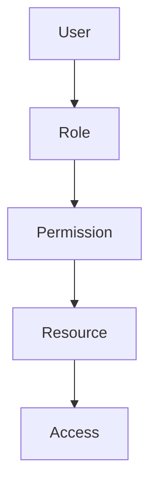
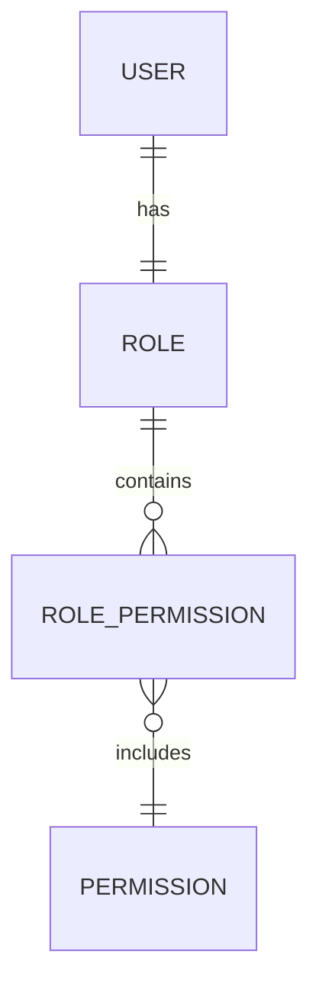

> [!info]
> **Project:** Authentication Service  
> **Section:** Authentication Design  
> **Document Type:** Authorization Architecture  
> **Objective:** Design role-based access control for managing user permissions.

---

# 📖 Overview

RBAC stands for:

```
Role-Based Access Control
```

It is a method of controlling user access based on their assigned role.

Instead of checking individual users:

```
User A can delete users

User B cannot
```

we define:

```
Roles

↓

Permissions

↓

Access Control
```

---

# Authentication vs Authorization

These concepts are different.

---

# Authentication

Question:

```
Who are you?
```

Example:

```
Email + Password

↓

User Verified
```

---

# Authorization

Question:

```
What are you allowed to do?
```

Example:

```
ADMIN

↓

Delete Users
```

---

# RBAC Flow



---

# RBAC Components

RBAC contains:

```
User

↓

Role

↓

Permission

↓

Resource
```

---

# User

A person using the application.

Example:

```
John
```

---

# Role

A collection of permissions.

Examples:

```
ADMIN

MANAGER

USER
```

---

# Permission

A specific action.

Examples:

```
CREATE_USER

DELETE_USER

VIEW_PROFILE
```

---

# Resource

The object being accessed.

Examples:

```
User Data

Reports

Settings
```

---

# Our Project Roles

Authentication Service uses:

```
ADMIN

MANAGER

USER
```

---

# Role Responsibilities

## ADMIN

Highest privilege.

Can:

```
Create Users

Delete Users

Manage Roles

View All Data
```

---

## MANAGER

Team-level access.

Can:

```
View Team Members

Manage Team Data
```

---

## USER

Normal application user.

Can:

```
View Own Profile

Update Own Data
```

---

# Permission Matrix

| Resource | ADMIN | MANAGER | USER |
|-|-|-|-|
| Create User | ✅ | ❌ | ❌ |
| Delete User | ✅ | ❌ | ❌ |
| View All Users | ✅ | ✅ | ❌ |
| View Own Profile | ✅ | ✅ | ✅ |
| Update Own Profile | ✅ | ✅ | ✅ |

---

# Database Design

## Users Table

```
Users

id

name

email

password_hash

role_id
```

---

## Roles Table

```
Roles

id

name
```

Example:

```
1 ADMIN

2 MANAGER

3 USER
```

---

## Permissions Table

```
Permissions

id

name
```

Example:

```
CREATE_USER

DELETE_USER

VIEW_PROFILE
```

---

## Role Permissions Table

Many-to-many relationship:

```
RolePermissions

role_id

permission_id
```

---

# RBAC Database Relationship



---

# Authorization Middleware

RBAC is implemented using middleware.

Flow:

```
Request

↓

Authentication Middleware

↓

Identify User

↓

Authorization Middleware

↓

Check Role

↓

Controller
```

---

# Authentication Middleware

Checks:

```
Is user logged in?
```

Example:

```
JWT Valid?

YES

↓

Continue
```

---

# Authorization Middleware

Checks:

```
Does user have permission?
```

Example:

```
Role = ADMIN?

YES

↓

Allow Access
```

---

# Example Route Protection

Admin route:

```
DELETE /api/users/:id
```

Middleware:

```
authenticate()

↓

authorize("ADMIN")

↓

Controller
```

---

# Authorization Flow Example

Request:

```
DELETE /api/users/123
```

---

Step 1:

Verify JWT:

```
User ID = 10
```

---

Step 2:

Find Role:

```
Role = USER
```

---

Step 3:

Check Permission:

```
DELETE_USER

Required:

ADMIN
```

---

Result:

```
403 Forbidden
```

---

# Role Based Middleware Example

Concept:

```javascript
authorize(
"ADMIN"
)
```

---

Allowed:

```
ADMIN
```

---

Rejected:

```
USER
```

---

# Why Use RBAC?

## Security

Users only access required resources.

---

## Maintainability

Adding permissions is easier.

---

## Scalability

Works for large applications.

---

# RBAC Security Rules

## Never Trust Client Role

Bad:

```json
{
"role":"ADMIN"
}
```

from client.

---

Always:

```
Database Role

↓

Authorization Check
```

---

## Check Permission Before Action

Example:

Before deleting user:

```
Check ADMIN permission
```

---

# Real World Examples

## Banking System

Roles:

```
CUSTOMER

EMPLOYEE

ADMIN
```

---

## E-commerce

Roles:

```
CUSTOMER

SELLER

ADMIN
```

---

## Enterprise Applications

Roles:

```
EMPLOYEE

MANAGER

HR

ADMIN
```

---

# Implementation Files

During coding:

```
src/

middleware/

auth.middleware.ts

role.middleware.ts


models/

role.model.ts


models/

permission.model.ts
```

---

# Testing Scenarios

## Admin Access

Role:

```
ADMIN
```

Expected:

```
200 OK
```

---

## User Access Admin API

Role:

```
USER
```

Expected:

```
403 Forbidden
```

---

## Missing Authentication

No JWT.

Expected:

```
401 Unauthorized
```

---

# 📝 Summary

RBAC controls what authenticated users can do.

Flow:

```
User

↓

Role

↓

Permission

↓

Resource Access
```

---

# 🧠 Key Takeaways

- Authentication identifies users.
- Authorization controls permissions.
- RBAC uses roles to manage access.
- Middleware protects routes.
- Never trust roles from clients.
- Database should be the source of truth.

---

# 🔗 Related Notes

- [[01 - Authentication Flow]]
- [[03 - JWT Design]]
- [[06 - Protected Routes API]]
- [[03 - Authorization Middleware]]
- [[08 - Session Management]]