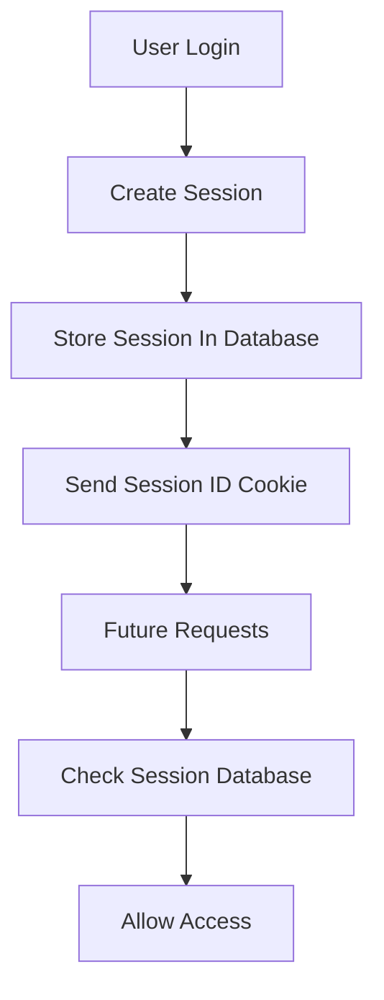
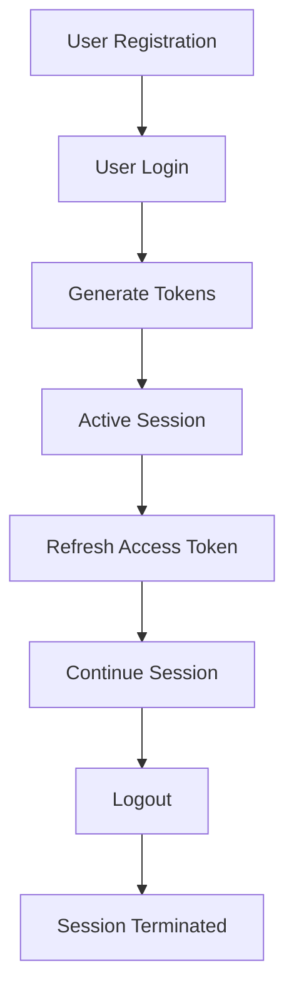

> [!info]
> **Project:** Authentication Service  
> **Section:** Authentication Design  
> **Document Type:** Session Architecture  
> **Objective:** Understand how user sessions are created, maintained, and terminated.

---

# 📖 Overview

A session represents the period during which a user is authenticated and can access protected resources.

Example:

```
User Login

↓

Authenticated Session

↓

User Uses Application

↓

Logout

↓

Session Ends
```

---

# What is a Session?

A session is a temporary state that represents:

```
A verified user's interaction with the application.
```

It contains information such as:

- User identity.
- Authentication status.
- Token validity.
- Session expiry.

---

# Traditional Session-Based Authentication

Before JWT became popular, applications used server-side sessions.

Flow:



---

# Example Traditional Session

Database:

```
Sessions Table

session_id

user_id

expires_at
```

Cookie:

```
session_id=abc123
```

---

Every request:

```
Client

↓

Session ID

↓

Server Database Lookup

↓

User Found

↓

Access Granted
```

---

# JWT Based Session Management

Our project uses:

```
JWT + Refresh Token
```

Instead of storing complete session data on the server.

---

# Our Session Architecture

```text
Client

↓

Access Token

+

Refresh Token Cookie

↓

Authentication Middleware

↓

User Verification

↓

Protected Resource
```

---

# Complete User Session Lifecycle



---

# Session Creation

Session starts after successful login.

Flow:

```
User Login

↓

Verify Email

↓

Compare Password Hash

↓

Generate Access Token

↓

Generate Refresh Token

↓

Store Refresh Token

↓

Create Session
```

---

# Active Session

During an active session:

Client sends:

```
Access Token
```

with every protected request.

Example:

```http
GET /api/v1/profile

Authorization: Bearer token
```

---

Backend:

```
Receive Request

↓

Verify JWT

↓

Identify User

↓

Allow Access
```

---

# Session Renewal

Access tokens have short expiry.

Example:

```
15 minutes
```

After expiry:

```
Access Token Expired

↓

Use Refresh Token

↓

Generate New Access Token

↓

Continue Session
```

---

# Session Termination

A session ends when:

## 1. User Logout

Example:

```
User clicks logout
```

Process:

```
Revoke Refresh Token

↓

Clear Cookie

↓

Session Ends
```

---

## 2. Refresh Token Expiry

Example:

```
Refresh Token expires after 7 days
```

Result:

```
User must login again
```

---

## 3. Security Revocation

Admin can terminate sessions.

Example:

```
Suspicious Login Detected

↓

Revoke Tokens

↓

Force Logout
```

---

# Session Data Management

Our system stores:

## Refresh Token Data

Database:

```
RefreshTokens
```

Contains:

```
id

user_id

token

expires_at

is_revoked

created_at
```

---

We do NOT store:

```
Password

Access Token

Sensitive Data
```

---

# JWT Session vs Database Session

| Feature | JWT Session | Server Session |
|-|-|-|
| Storage | Client Token | Server Database |
| Scalability | High | Requires shared storage |
| Server Memory | Low | Higher |
| Revocation | Requires token management | Easy |
| Microservices | Friendly | More complex |

---

# Session Security

## 1. Token Expiry

Use:

```
Short Access Token

Long Refresh Token
```

---

## 2. Refresh Token Rotation

Every refresh:

```
Old Token

↓

Invalidated

↓

New Token Created
```

---

## 3. Logout Revocation

Logout should invalidate sessions.

---

## 4. Secure Cookies

Refresh token cookie:

```
HTTP Only

Secure

SameSite
```

---

# Multiple Device Sessions

Real applications support:

```
Laptop Login

+

Mobile Login

+

Tablet Login
```

Each device has:

```
Different Refresh Token
```

Example:

```
RefreshToken 1
Device: Laptop


RefreshToken 2
Device: Mobile
```

---

# Session Management Features

Future improvements:

## View Active Sessions

Example:

```
Device: Chrome

Location: Hyderabad

Last Active: Today
```

---

## Logout From All Devices

Process:

```
Delete All Refresh Tokens

↓

Require Login Again
```

---

## Detect Suspicious Sessions

Example:

```
New Device Login

↓

Send Alert
```

---

# Implementation Files

During coding:

```
src/

services/

session.service.ts


models/

refreshToken.model.ts


controllers/

auth.controller.ts
```

---

# Testing Scenarios

## Login Creates Session

Expected:

```
Refresh Token Stored
```

---

## Access Token Expired

Expected:

```
Refresh Token Creates New Token
```

---

## Logout

Expected:

```
Refresh Token Revoked

Cookie Removed
```

---

## Revoked Token Usage

Expected:

```
401 Unauthorized
```

---

# 📝 Summary

Session management controls the complete user login lifecycle.

Our design:

```
Login

↓

Create Tokens

↓

Maintain Session

↓

Refresh Tokens

↓

Logout

↓

Terminate Session
```

---

# 🧠 Key Takeaways

- A session represents authenticated user activity.
- JWT provides stateless authentication.
- Refresh tokens maintain long sessions.
- Logout must revoke sessions.
- Token rotation improves security.
- Production systems manage active sessions.

---

# 🔗 Related Notes

- [[01 - Authentication Flow]]
- [[03 - JWT Design]]
- [[04 - Access Token Design]]
- [[05 - Refresh Token Design]]
- [[06 - Cookie Strategy]]
- [[07 - RBAC Design]]
- [[01 - Database Overview]]