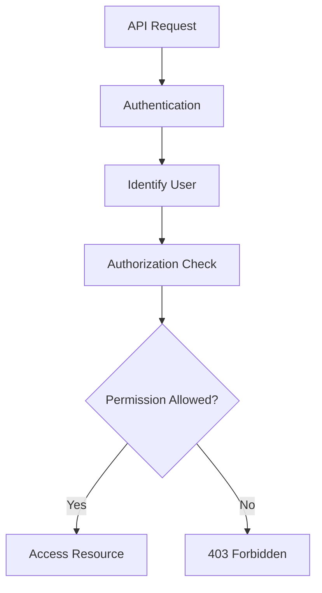

> [!info]
> **Project:** Authentication Service  
> **Section:** Authorization Design  
> **Document Type:** Access Control Architecture  
> **Objective:** Understand how the system controls user access to resources.

---

# 📖 Overview

Authorization is the process of deciding what actions an authenticated user is allowed to perform.

It answers:

```
What can this user do?
```

Example:

A user successfully logs in:

```
Authentication

↓

User identified as John
```

Now the system checks:

```
Authorization

↓

Can John delete users?
```

---

# Authentication vs Authorization

Authentication and Authorization are different concepts.

```
Authentication

↓

Who are you?


Authorization

↓

What are you allowed to do?
```

---

# Authentication

Purpose:

Verify user identity.

Example:

```
Email

+

Password

↓

Valid User
```

Output:

```
User ID = 123
```

---

# Authorization

Purpose:

Control user permissions.

Example:

```
User ID = 123

Role = USER

↓

Can access profile

Cannot delete users
```

---

# Authorization Flow



---

# Where Authorization Happens?

Authorization happens after authentication.

Request lifecycle:

```
Client Request

↓

Authentication Middleware

↓

Authorization Middleware

↓

Controller

↓

Service

↓

Database
```

---

# Example Scenario

## API

```
DELETE /api/users/123
```

---

Step 1: Authentication

Check:

```
Is user logged in?
```

JWT:

```json
{
"userId":"10"
}
```

Result:

```
User authenticated
```

---

Step 2: Authorization

Check:

```
Does user have delete permission?
```

Example:

```
Role = USER
```

Result:

```
Access Denied
```

Response:

```
403 Forbidden
```

---

# Why Authorization is Required?

Without authorization:

Example:

```
Normal User

↓

Admin API

↓

Delete all users
```

This creates security vulnerabilities.

---

# Authorization Components

Authorization contains:

```
User

↓

Role

↓

Permission

↓

Resource
```

---

# User

The person accessing the application.

Example:

```
John
```

---

# Role

Defines user category.

Example:

```
ADMIN

MANAGER

USER
```

---

# Permission

Defines allowed actions.

Example:

```
CREATE_USER

DELETE_USER

VIEW_PROFILE
```

---

# Resource

The thing being protected.

Examples:

```
User Data

Reports

Orders

Payments
```

---

# Types of Authorization

Common authorization approaches:

---

## 1. Role-Based Access Control (RBAC)

Access depends on user role.

Example:

```
ADMIN

↓

Delete Users
```

Used in our project.

---

## 2. Attribute-Based Access Control (ABAC)

Access depends on attributes.

Example:

```
Department = HR

Location = India

↓

Allow Access
```

---

## 3. Permission-Based Access Control

Access depends on specific permissions.

Example:

```
Permission:

DELETE_USER

↓

Allow Delete Operation
```

---

# Our Project Authorization Model

We use:

```
RBAC + Permission Based Authorization
```

Flow:

```
User

↓

Role

↓

Permissions

↓

Resource Access
```

---

# Authorization Rules

## Rule 1: Never Trust Client Data

Wrong:

Client sends:

```json
{
"role":"ADMIN"
}
```

Never trust this.

---

Correct:

```
JWT User ID

↓

Database Lookup

↓

Get User Role

↓

Check Permission
```

---

## Rule 2: Follow Least Privilege

Users should get only required access.

Example:

```
USER

↓

Own Profile Only
```

Not:

```
All Users Data
```

---

## Rule 3: Deny By Default

Default:

```
No Permission

↓

Access Denied
```

Only explicitly allowed actions succeed.

---

# HTTP Status Codes

Authorization failures use:

---

## 401 Unauthorized

Meaning:

User is not authenticated.

Example:

```
Missing JWT Token
```

---

## 403 Forbidden

Meaning:

User is authenticated but not allowed.

Example:

```
USER trying ADMIN API
```

---

# Implementation Plan

During coding:

```
src/

middlewares/

auth.middleware.ts

authorization.middleware.ts


services/

permission.service.ts
```

---

# 📝 Summary

Authorization controls access after authentication.

Flow:

```
User Login

↓

Authentication

↓

Identify User

↓

Authorization

↓

Check Permission

↓

Allow / Deny Access
```

---

# 🧠 Key Takeaways

- Authentication identifies the user.
- Authorization controls actions.
- Authorization happens after authentication.
- RBAC is our main authorization model.
- Permissions define allowed actions.
- Use 403 for permission failures.
- Never trust client roles.

---

# 🔗 Related Notes

- [[01 - Authentication Flow]]
- [[02 - RBAC & Permissions]]
- [[03 - Authorization Middleware]]
- [[04 - Protected Resource Access]]