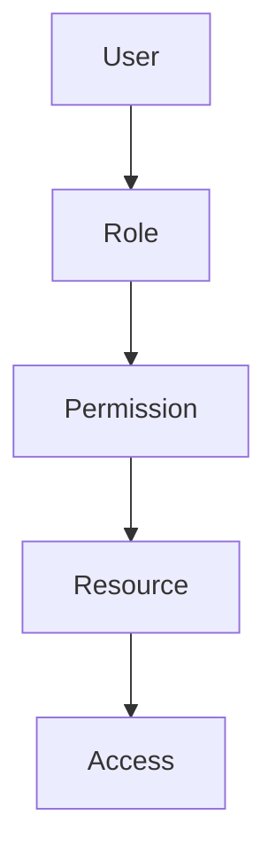
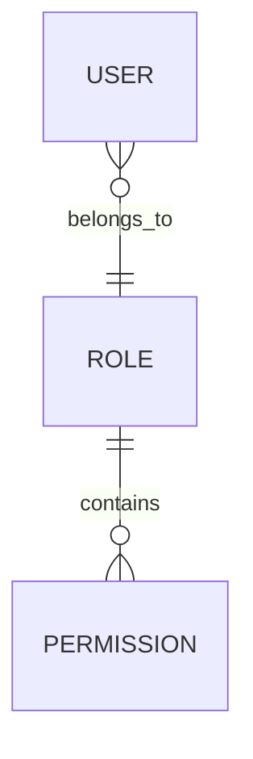

> [!info]
> **Project:** Authentication Service  
> **Section:** Authorization Design  
> **Document Type:** RBAC Architecture  
> **Objective:** Design a Role-Based Access Control (RBAC) system for managing user permissions.

---

# 📖 Overview

RBAC stands for:

```
Role-Based Access Control
```

RBAC is an authorization model where permissions are assigned to roles, and users are assigned to those roles.

Instead of assigning permissions directly to every user, we assign them to roles.

Flow:

```
User

↓

Role

↓

Permission

↓

Resource Access
```

---

# Why RBAC?

Imagine an application with 10,000 users.

Without RBAC:

```
John
↓

Can Create User

Can Delete User

Can View Reports

Can Edit Profile

...
```

Every user would need individual permission management.

This becomes difficult to maintain.

With RBAC:

```
ADMIN

↓

Create User

Delete User

View Reports

Manage Roles
```

Now every Admin automatically gets these permissions.

---

# Core Components

RBAC consists of four components.

## 1. User

A person using the application.

Example:

```
John
```

---

## 2. Role

A collection of permissions.

Example:

```
ADMIN

MANAGER

USER
```

---

## 3. Permission

A specific action that can be performed.

Examples:

```
CREATE_USER

UPDATE_USER

DELETE_USER

VIEW_PROFILE
```

---

## 4. Resource

The entity being protected.

Examples:

```
Users

Orders

Payments

Reports
```

---

# RBAC Architecture



---

# Our Project Roles

We will use three roles.

## ADMIN

Responsibilities:

- Manage users
- Assign roles
- Delete users
- View all data

---

## MANAGER

Responsibilities:

- View team members
- Manage team information
- Update assigned resources

---

## USER

Responsibilities:

- View own profile
- Update own profile
- Access personal resources

---

# Permission List

| Permission | Description |
|------------|-------------|
| CREATE_USER | Create a new user |
| VIEW_USER | View user details |
| UPDATE_USER | Update user information |
| DELETE_USER | Delete a user |
| VIEW_PROFILE | View own profile |
| UPDATE_PROFILE | Update own profile |
| ASSIGN_ROLE | Assign roles to users |

---

# Role-Permission Mapping

| Permission | ADMIN | MANAGER | USER |
|------------|:-----:|:-------:|:----:|
| CREATE_USER | ✅ | ❌ | ❌ |
| VIEW_USER | ✅ | ✅ | ❌ |
| UPDATE_USER | ✅ | ✅ | ❌ |
| DELETE_USER | ✅ | ❌ | ❌ |
| VIEW_PROFILE | ✅ | ✅ | ✅ |
| UPDATE_PROFILE | ✅ | ✅ | ✅ |
| ASSIGN_ROLE | ✅ | ❌ | ❌ |

---

# Database Design

Our RBAC system can be represented as:

```text
Users

↓

Roles

↓

Permissions
```

Simplified relationship:



---

# Request Flow

Example:

```
DELETE /api/v1/users/25
```

Flow:

```
Request

↓

Authentication Middleware

↓

JWT Verified

↓

User Role Retrieved

↓

Permission Checked

↓

Controller

↓

Response
```

---

# Authorization Decision

Example:

Logged-in user:

```
Role = USER
```

Requested action:

```
DELETE_USER
```

Permission table:

```
USER

↓

DELETE_USER ❌
```

Response:

```
403 Forbidden
```

---

# Middleware Example

Conceptually:

```typescript
authorize("ADMIN")
```

Flow:

```
Incoming Request

↓

Read User Role

↓

Compare Required Role

↓

Allow / Deny
```

---

# Route Protection Example

Admin-only API:

```http
DELETE /api/v1/users/:id
```

Protected by:

```typescript
authenticate()

↓

authorize("ADMIN")
```

---

# Why Keep Roles Separate from Users?

Suppose we introduce a new role:

```
SUPPORT_ENGINEER
```

With RBAC:

```
Create Role

↓

Assign Permissions

↓

Assign Users
```

No changes are required for every individual user.

---

# RBAC Best Practices

## Follow Least Privilege

Give users only the permissions they need.

Example:

```
USER

↓

View Own Profile

❌ Delete Users
```

---

## Never Trust Client Data

Do NOT accept:

```json
{
  "role": "ADMIN"
}
```

from the client.

Always retrieve the role from:

```
Database

or

Verified JWT
```

---

## Deny by Default

If permission is not explicitly granted:

```
Access Denied
```

---

## Keep Permissions Granular

Good:

```
VIEW_PROFILE

UPDATE_PROFILE

DELETE_USER
```

Avoid vague permissions like:

```
FULL_ACCESS
```

---

# Implementation Plan

During coding:

```
src/

middleware/
    auth.middleware.ts
    authorize.middleware.ts

models/
    role.model.ts
    permission.model.ts

services/
    authorization.service.ts
```

---

# 📝 Summary

RBAC simplifies authorization by assigning permissions to roles instead of individual users.

Flow:

```
User

↓

Role

↓

Permissions

↓

Access Decision
```

---

# 🧠 Key Takeaways

- RBAC stands for Role-Based Access Control.
- Roles are collections of permissions.
- Users are assigned roles.
- Permissions define allowed actions.
- Middleware checks permissions before accessing resources.
- Always follow the principle of least privilege.

---

# 🔗 Related Notes

- [[01 - Authorization Overview]]
- [[03 - Authorization Middleware]]
- [[04 - Protected Resource Access]]
- [[01 - Authentication Flow]]