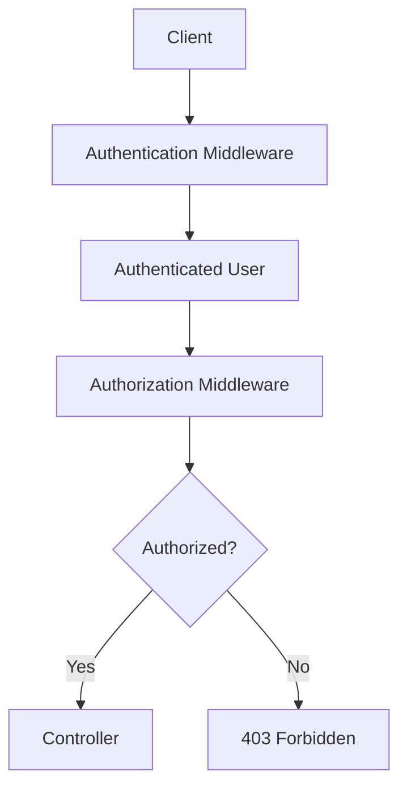

> [!info]
> **Project:** Authentication Service  
> **Section:** Authorization Design  
> **Document Type:** Middleware Design  
> **Objective:** Understand how authorization middleware protects API endpoints.

---

# 📖 Overview

Authorization middleware checks whether an authenticated user has permission to access a specific resource.

It acts as a security checkpoint before the request reaches the controller.

Flow:

```
Client Request

↓

Authentication Middleware

↓

Authorization Middleware

↓

Controller

↓

Service

↓

Database
```

---

# Why Do We Need Authorization Middleware?

Without authorization middleware:

```
User

↓

Calls Admin API

↓

Controller Executes

↓

Security Risk
```

With authorization middleware:

```
User

↓

Permission Check

↓

Allowed?

↓

YES → Controller

NO → 403 Forbidden
```

---

# Middleware Responsibilities

Authorization middleware should:

- Read the authenticated user's role.
- Determine the required role(s) for the route.
- Compare the user's role with the required role(s).
- Allow or reject the request.

---

# Request Lifecycle



---

# Example Route

Admin-only endpoint:

```http
DELETE /api/v1/users/10
```

Protected using:

```typescript
authenticate();

authorize("ADMIN");
```

Flow:

```
Request

↓

Verify JWT

↓

Extract User Role

↓

Compare Required Role

↓

Controller
```

---

# Example

Authenticated user:

```text
Role = USER
```

Route requires:

```text
ADMIN
```

Result:

```
403 Forbidden
```

---

# Multiple Allowed Roles

Sometimes more than one role can access a route.

Example:

```
ADMIN

MANAGER
```

Concept:

```typescript
authorize("ADMIN", "MANAGER")
```

Flow:

```
User Role

↓

ADMIN?

↓

No

↓

MANAGER?

↓

Yes

↓

Allow Access
```

---

# Authorization Decision Table

| User Role | Required Role | Result |
|------------|---------------|--------|
| ADMIN | ADMIN | ✅ Allow |
| USER | ADMIN | ❌ Deny |
| MANAGER | ADMIN | ❌ Deny |
| MANAGER | MANAGER | ✅ Allow |
| USER | USER | ✅ Allow |

---

# Error Response

When authorization fails:

Status Code:

```http
403 Forbidden
```

Example response:

```json
{
  "success": false,
  "message": "You are not authorized to access this resource."
}
```

---

# Authentication vs Authorization Failure

## Authentication Failure

Reason:

```
Missing

Invalid

Expired JWT
```

Response:

```
401 Unauthorized
```

---

## Authorization Failure

Reason:

```
Valid JWT

↓

Insufficient Permission
```

Response:

```
403 Forbidden
```

---

# Best Practices

## Keep Middleware Generic

Instead of creating:

```
adminMiddleware()

managerMiddleware()

userMiddleware()
```

Create one reusable middleware:

```typescript
authorize(...roles)
```

---

## Don't Trust Client Data

Never check:

```json
{
  "role": "ADMIN"
}
```

sent by the client.

Always use the role obtained after successful authentication.

---

## Separate Responsibilities

Authentication Middleware:

```
Who is the user?
```

Authorization Middleware:

```
What can the user do?
```

---

# Implementation Plan

During coding:

```
src/

middleware/

auth.middleware.ts

authorize.middleware.ts
```

Example request flow:

```
Request

↓

authenticate()

↓

authorize("ADMIN")

↓

Controller
```

---

# 📝 Summary

Authorization middleware protects API endpoints by checking whether the authenticated user has the required permissions.

Flow:

```
Authenticate User

↓

Check Role

↓

Allow or Deny Access
```

---

# 🧠 Key Takeaways

- Authorization middleware runs after authentication.
- It checks roles and permissions.
- Unauthorized requests return **403 Forbidden**.
- Middleware should be reusable.
- Authentication and authorization have separate responsibilities.

---

# 🔗 Related Notes

- [[01 - Authorization Overview]]
- [[02 - RBAC & Permissions]]
- [[04 - Protected Resource Access]]
- [[01 - Authentication Flow]]