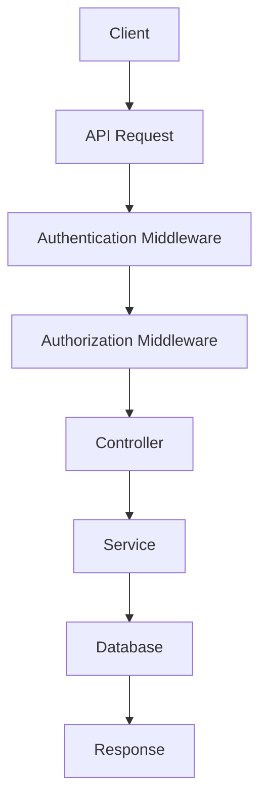

> [!info]
> **Project:** Authentication Service  
> **Section:** Authorization Design  
> **Document Type:** Resource Protection Design  
> **Objective:** Understand how protected resources are secured using authentication and authorization.

---

# 📖 Overview

A protected resource is any API endpoint or data that should only be accessible to authenticated and authorized users.

Examples:

- User Profile
- Admin Dashboard
- User Management
- Reports
- Settings

---

# What is a Protected Resource?

A protected resource requires:

1. Authentication
2. Authorization

Before access is granted.

Flow:

```
Client Request

↓

Authentication

↓

Authorization

↓

Protected Resource

↓

Response
```

---

# Request Flow



---

# Example 1

API:

```http
GET /api/v1/profile
```

Who can access?

```
ADMIN

MANAGER

USER
```

Reason:

Every authenticated user can view their own profile.

---

# Example 2

API:

```http
DELETE /api/v1/users/:id
```

Who can access?

```
ADMIN
```

Reason:

Deleting users is a privileged operation.

---

# Example 3

API:

```http
GET /api/v1/users
```

Who can access?

```
ADMIN

MANAGER
```

Reason:

Managers and administrators can view user information.

---

# Access Matrix

| API Endpoint | ADMIN | MANAGER | USER |
|--------------|:-----:|:-------:|:----:|
| GET /profile | ✅ | ✅ | ✅ |
| PUT /profile | ✅ | ✅ | ✅ |
| GET /users | ✅ | ✅ | ❌ |
| DELETE /users/:id | ✅ | ❌ | ❌ |
| POST /users | ✅ | ❌ | ❌ |

---

# Protected Route Example

Conceptually:

```typescript
router.delete(
    "/users/:id",
    authenticate,
    authorize("ADMIN"),
    deleteUser
);
```

Flow:

```
Request

↓

Authenticate

↓

Authorize

↓

Execute Controller
```

---

# Authentication Failure

Example:

No JWT Token.

Response:

```http
401 Unauthorized
```

Example response:

```json
{
  "success": false,
  "message": "Authentication required."
}
```

---

# Authorization Failure

Example:

Logged-in USER tries:

```http
DELETE /api/v1/users/10
```

Response:

```http
403 Forbidden
```

Example response:

```json
{
  "success": false,
  "message": "Access denied."
}
```

---

# Resource Protection Strategy

Every protected request follows:

```
Receive Request

↓

Verify JWT

↓

Identify User

↓

Read User Role

↓

Check Permission

↓

Execute Business Logic

↓

Return Response
```

---

# Public vs Protected APIs

## Public APIs

Accessible without login.

Examples:

```
POST /auth/register

POST /auth/login

POST /auth/refresh
```

---

## Protected APIs

Require authentication.

Examples:

```
GET /profile

PUT /profile

POST /logout
```

---

## Restricted APIs

Require both authentication and specific roles.

Examples:

```
DELETE /users/:id

POST /users

PATCH /roles
```

---

# Best Practices

## Protect Every Sensitive Endpoint

Never expose:

- User data
- Administrative actions
- Internal operations

without authorization.

---

## Validate Before Business Logic

Correct flow:

```
Authenticate

↓

Authorize

↓

Execute Controller
```

Never:

```
Execute Controller

↓

Then Check Permission
```

---

## Use Reusable Middleware

Instead of repeating permission checks inside controllers, use middleware to centralize authorization logic.

---

# Implementation Plan

During coding:

```
src/

routes/

auth.routes.ts

user.routes.ts


middleware/

auth.middleware.ts

authorize.middleware.ts
```

---

# 📝 Summary

Protected resources ensure that only the right users can access sensitive data and operations.

Flow:

```
Client Request

↓

Authentication

↓

Authorization

↓

Protected Resource

↓

Response
```

---

# 🧠 Key Takeaways

- Protected resources require authentication.
- Sensitive operations require authorization.
- Use middleware to enforce access control.
- Return **401** for authentication failures.
- Return **403** for authorization failures.
- Validate access before executing business logic.

---

# 🔗 Related Notes

- [[01 - Authorization Overview]]
- [[02 - RBAC & Permissions]]
- [[03 - Authorization Middleware]]
- [[01 - Authentication Flow]]
- [[01 - API Overview]]